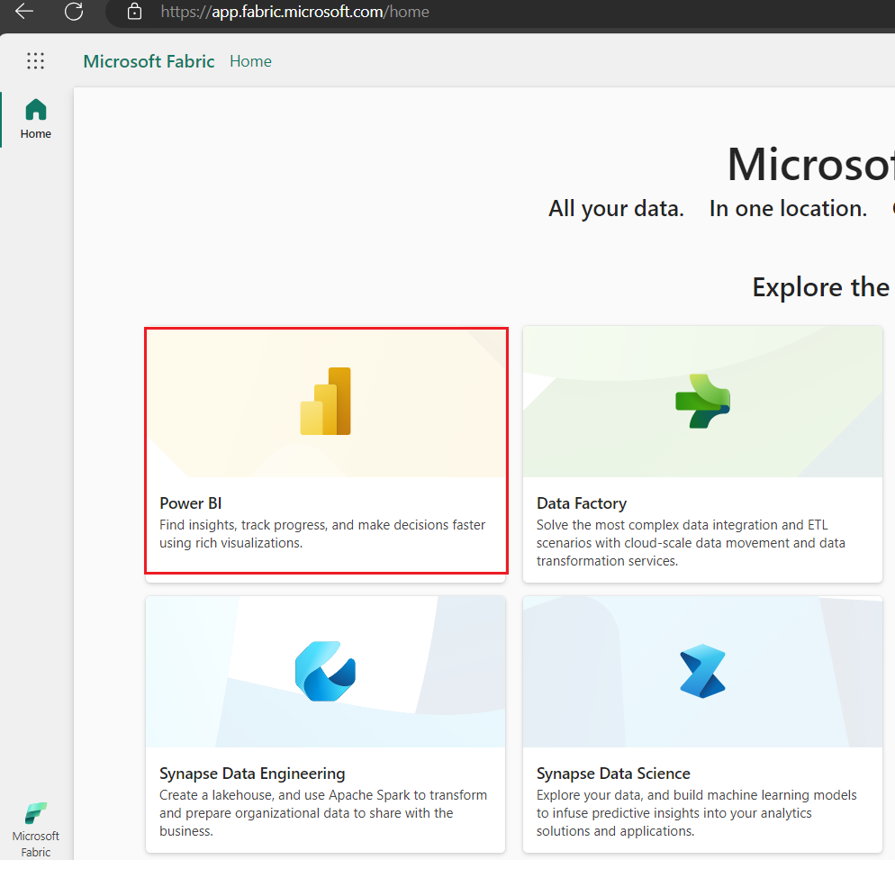
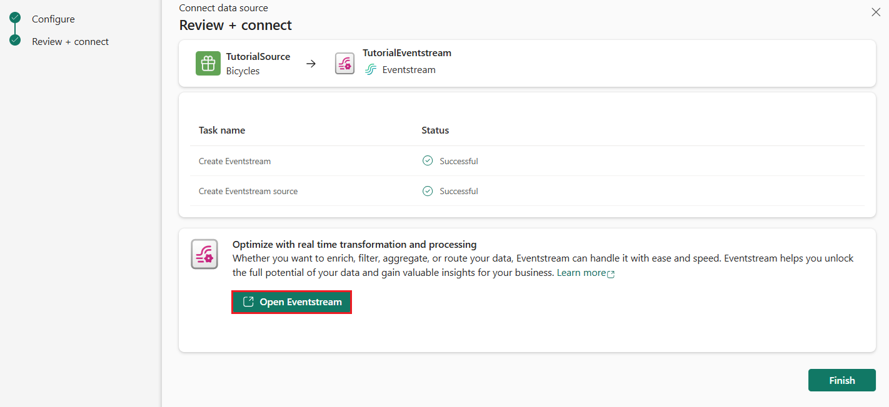
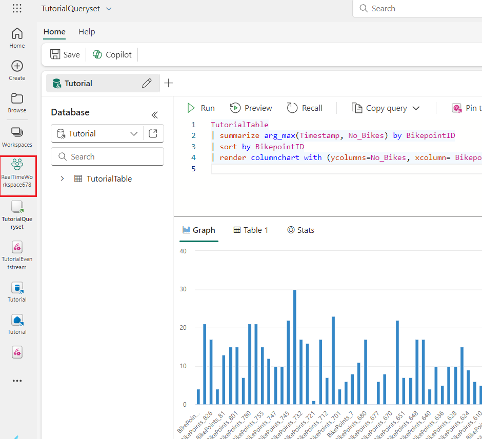
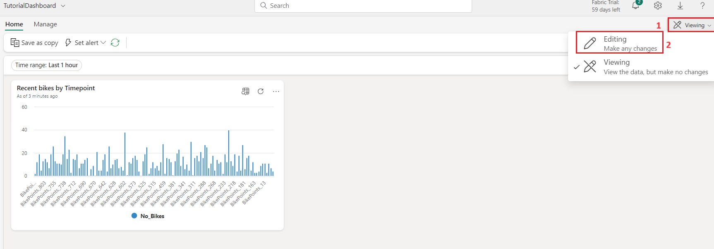
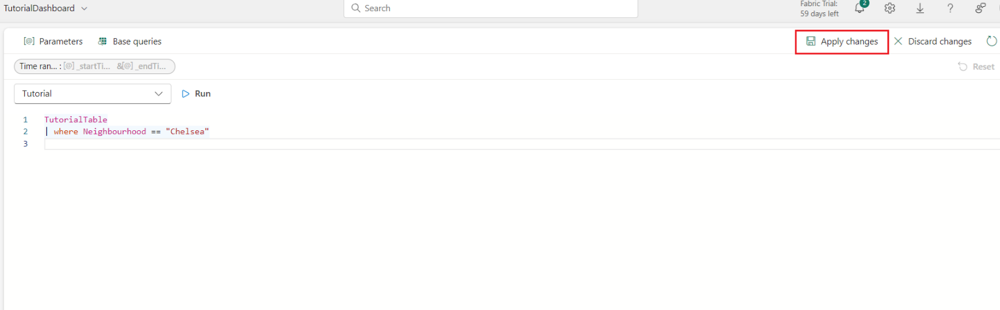
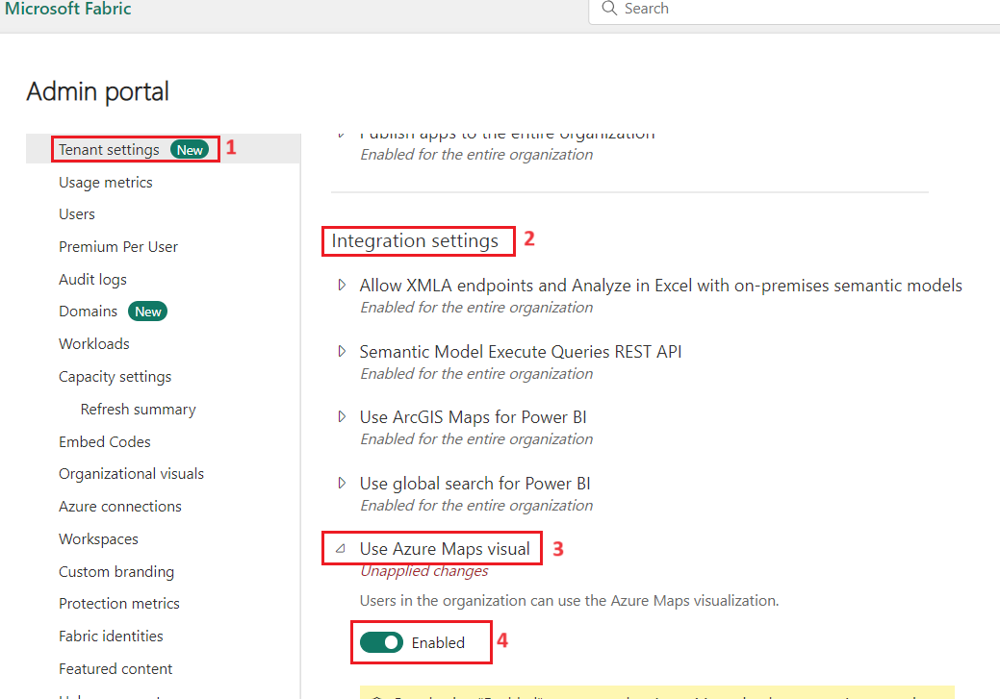

# **Use case 02 -Working with Real-Time hub in Microsoft Fabric**
**Introduction**

Real-Time Intelligence in Microsoft Fabric is a powerful tool to extract
insights and visualize your data in motion. Real-Time Intelligence
provides an end-to-end solution for event-driven scenarios, streaming
data, and data logs.

In this use case , you'll learn how to set up and use the main features
of Real-Time Intelligence with a sample set of data.

The sample data you'll use in this tutorial is a set of bicycle data,
containing information about bike ID, location, timestamp, and more.
You'll learn how to set up resources, ingest data, set alerts on the
data, and visualize the data to extract insights.

**Objective**

- Set up your environment

- Get data in the Real-Time hub

- Transform events

- Publish an event stream

- Create a KQL query

- Create a Real-Time dashboard

- Explore data visually in the Real-Time dashboard

- Create a Power BI report from a KQL query

- Set an alert on the event stream

# Exercise 1: Environment Setup

## **Task 1: Create a Fabric workspace**

In this task, you create a Fabric workspace. The workspace contains all
the items needed for this lakehouse tutorial, which includes lakehouse,
dataflows, Data Factory pipelines, the notebooks, Power BI datasets, and
reports.

1.  Open your browser, navigate to the address bar, and type or paste
    the following URL: +++https://app.fabric.microsoft.com/+++ then press the
    **Enter** button. In the **Microsoft Fabric Home** page, navigate
    and click on **Power BI** tile.

     

2.  In the **Power BI Home** page left-sided navigation menu, navigate
    and click on **Workspaces** as shown in the below image.

    

3.  In the Workspaces pane, click on **+New workspace button**

     

4.  In the **Create a workspace** pane that appears on the right side,
    enter the following details, and click on the **Apply** button.

    |  |  |
    |---|---|
    |Name	|+++RealTimeWorkspaceXX+++(XX can be a unique number)| 
    |Advanced|	Under License mode, select Trial|
    |Default |storage format	Small dataset storage format|


    
    
    
    

## Task 3: Create an eventhouse

1.  On the bottom left experience switcher, select **Real-Time
    Intelligence**.

    

2.  On the **Real-Time Intelligence** home page, select **Eventhouse**.
    Name the Eventhouse +++Tutorial+++  and click on the **Create**
    button.

      
 
      

3.  When provisioning is complete, the eventhouse **System
    overview** page is shown.

    

## Task 4: Turn on OneLake availability

1.  From the **System overview** page, select the **Tutorial** KQL
    database you created in the previous task.

     

2.  Select **Tutorial**, click on the **OneLake availability** as shown
    in the below image to change the setting and, then click on the
    **Turn on** Toggle the button enable OneLake access.

    
    
    

    

# Exercise 2: Get data in the Real-Time hub

## Task 1: Create an event stream

1.  From the navigation bar, select **Real-Time**.

    
 
    

2.  In the **Real-Time hub** page , Select the **Bicycle rentals**

     

3.  In **Connect** tab, under **Sample data** enter the **Source name**
    as +++TutorialSource+++
    

4.  Under the **Stream details, **edit** the **Eventstream name** by
    selecting the pencil icon and
    entering +++TutorialEventstream+++. Select **Next**.

      

5.  In the **Review and create** tab, review the event stream details
    and select **Connect**.

      

6.  A new event stream named  **TutorialEventstream**  is created.

7.  Select **Open Eventstream** from the notification that appears after
    creating the event stream.

    

    

## Task 2: Transform events

1.  In the **Eventstream** page, select **Edit** from the menu ribbon.

     

2.  In the event stream authoring canvas, select the down arrow on
    the **Transform events or add destination** tile. Select **Manage
    fields**. The tile is renamed to  **Manage_fields** .

     

3.  Select the **pencil** icon on the ***Manage_fields*** tile.

     

3.  In the  **Manage fields**  pane, in **Operation name**,
    nter +++TutorialTransform+++ and Select **Add all fields**

     

4.  In the ***Manage fields*** pane, Select **+ Add field**.

     

5.  In the ***Manage fields*** pane, dropdown the Field and from
    the **Built-in Date Time Function** dropdown,
    select **SYSTEM.Timestamp()**

      

7.  Enter +++Timestamp+++ as the **Field name** andSelect **Add**.

      

8.  In **Manage fields** tab, Select **Save**.

     

9.  The **TutorialTransform** tile now displays but with an error, because
    the destination isn't set.

    

## Task 3: Create a destination

1.  Hover over the right edge of the  **TutorialTransform**  tile and
    select the **green plus** icon.

    

2.  Select **Destinations** \> **Eventhouse**.

    

3.  A new tile is created entitled **Eventhouse**

      

4.  Select the **pencil icon** on the ***Eventhouse*** tile.

      

5.  Enter the following information in the **Eventhouse** pane and
    select the **Save** button.

    |Field	|Value|
    |---|---|
    |Destination name|Enter +++TutorialDestination+++|
    |Workspace|	Select the workspace in which you created your resources.|
    |Eventhouse|Tutorial|
    |KQL Database|Tutorial|
    |KQL Destination table|	Create new - enter +++TutorialTable+++ as table name and click on Done button|
    |Input data format|	JSON|
    
    
    
    

    

6.  From the menu ribbon, select **Publish**.

    

7.  The event stream is now set up to transform events and send them to
    a KQL database.

    

# Exercise 3: Query streaming data in a KQL queryset

In this exercise, you learn how to query your streaming data in a [KQL
queryset](https://learn.microsoft.com/en-us/fabric/real-time-intelligence/create-query-set).
You create a KQL queryset, write a KQL query, and visualize the data in
a time chart.

## Task 1: Create a KQL queryset

1.  From the navigation bar, select the KQL database you created in
    exercise1\> task3, named **Tutorial**

    

2.  Verify that the data is flowing into the database by viewing
    the **Size** tile in the database details page. The values in this
    tile should be greater than zero. If the values in the **Size** tile
    are zero, select **Refresh** from the menu ribbon.

    

3.  From the menu ribbon, select **New related item** and choose **KQL
    Queryset**.

    

4.  Enter the name for the KQL
    Queryset: +++TutorialQueryset+++ and select **Create**.

      

5.  Select the **Tutorial**database as the data source for the KQL
    queryset, then select **Connect**.

    

6.  A new KQL queryset is created and opens in the KQL Queryset editor.
    It's connected to the *Tutorial* database as a data source, and is
    pre-populated with several general queries.

    

## Task 2: Write a KQL query

The name of the table you created in a previous step is *TutorialTable*.
Use this (case-sensitive) name as the data source for your query.

1.  In the query editor, delete the pre-populated queries and enter the
    following query. Then press **Shift + Enter** to run the query or
    **▷ Run** button and review the output.

     **KustoCopy**
    ``` 
    TutorialTable
    | take 10
    ```
    

    This query returns 10 arbitrary records from the table. What information
    about the data can you see at a glance? Notice that one of the columns
    is named *No_Bikes*. This column contains the number of empty docks at a
    bike station. This is a field you may be concerned with if you're
    tracking the availability of bikes at a station.

2.  To see the data in a more visual way, use the **render** operator.
    Run the following query:

3.  Replace all the code in the **cell** with the following code and
    click on **▷ Run** button and review the output.

    **KustoCopy**
    ```
    TutorialTable
    | where Neighbourhood == "Chelsea"
    | project Timestamp, No_Bikes
    | render timechart
    ```
    This query creates a time chart that shows the number of bikes in the
    Chelsea neighborhood as a time chart.
    
    

# Exercise 4: Create a Real-Time Dashboard

## Task 1: Create a Real-Time Dashboard

1.  In your KQL queryset, copy/paste, and run the following query. This
    query returns a column chart showing the most recent number of bikes
    by **BikepoointID**.

2.  Replace all the code in the **cell** with the following code and
    click on **▷ Run** button and review the output.

    **KustoCopy**
    ```
    TutorialTable
    | summarize arg_max(Timestamp, No_Bikes) by BikepointID
    | sort by BikepointID
    | render columnchart with (ycolumns=No_Bikes, xcolumn= BikepointID)
    ```
    

3.  Now, click on **RealTimeWorkspace** on the left-sided navigation
    pane as shown in the below image.

    

4.  In the **RealTime workspace** page, navigate to **+New item**
    section and click on, select **Real-Time Dashbord** 

     

5.  **New Real-Time Dashboard**  dialog box, enter
    +++TutorialDashboard+++ in the **Name** field, click on the
    **Create** button and open the new **Real-Time Dashboard**

     

    

    

6.  Select **Pin to dashboard**.

     

7.  In  **Pin query to dashboard**, click on the **Select from OneLake
    hub.**

     

8.  In **OneLake data hub** pane ,select **TutorialDashboard** and click
    on **Add** button.

    

9.  Enter the following information and click on **Create** button

    |Field|	Value|
    |---|---|
    |Create new tile|	In a new dashboard|
    |Dashboard name	|TutorialDashboard|
    |Tile name	|Recent bikes by Timepoint|
    |Open dashboard after creation|	Selected|
    
    

    The new dashboard, **TutorialDashboard**, opens with the **Recent bikes by
    Bikepoint** tile.

    

## Task 2: Add a new tile to the dashboard

1.  On the top menu bar, toggle from **Viewing** mode
    to **Editing** mode.

    

2.  Select **New tile**

    

3.  In the query editor, enter the following query:

    KustoCopy
    ```
    TutorialTable
    | where Neighbourhood == "Chelsea"
    ```
    
    

4.  From the menu ribbon, Select **Apply changes**. A new tile is
    created.

    

    

5.  Rename the tile by selecting the **More menu \[...\]** on the top
    right corner of the tile \> **Rename tile**.

    

6.  Enter the new name ***+++Chelsea bikes+++*** to rename the tile.

    

## Task 3: Explore the data visually by adding an aggregation

1.  On the new **Chelsea bikes** tile, select the **Explore** icon.
    

    

    

2.  Select **+ Add** \> **Aggregation**.

    
    
3.  Select **+ Add grouping**.

    

4.  Select **Group by** \> *Street*.

    

5.  Select **Apply**.

    
    
    

6.  Notice that the query elements are updated to include the
    green **count() by Street** aggregation. The resulting table changed
    to show the total count of bike locations by street.

    

7.  Close the **Explore** pane and select **Save** from the menu ribbon
    to save the changes.

    
    
    
    
    

# Exercise 5: Create a Power BI report

A Power BI report is a multi-perspective view into a semantic model,
with visuals that represent findings and insights from that semantic
model. In this section, you use a KQL query output to create a new Power
BI report.

## Task 1: Build a Power BI report

1.  From the navigation bar, select the KQL queryset you created in a
    previous step, named **TutorialQueryset**

    

2.  Copy and paste the following query into the query editor. The output
    of this query is used as the semantic model for building the Power
    BI report.

    **KustoCopy**
    ```
    TutorialTable
    | summarize arg_max(Timestamp, No_Bikes,  No_Empty_Docks, Neighbourhood, Lat=todouble(Latitude), Lon=todouble(Longitude)) by BikepointID
    ```
    

3.  Select **Power BI**. The Power BI report editor opens with the query
    result available as a data source named **Kusto Query Result**.

    
    
    

## Task 2: Enable azure maps visuals sign in

1.  Open your browser, navigate to the address bar, and type or paste
    the following URL: +++https://app.fabric.microsoft.com/home+++ then
    press the **Enter** button. In Microsoft Fabric page, click on
    **Power BI**.

    

2.  On right side of Power BI home page, click on the **Settings** icon.

    

    In case, you did not see the **Settings** icon, then click on the
    horizontal ellipsis on the top right side of the page, then navigate and
    click on **Settings** as shown in the below image.

3.  In Settings pane, scroll down to Governance and insights, then click
    on Admin portal .

    
    
    

4.  In **Admin portal** pane, select **Tenant settings**, scroll down to
    **Integration settings** section, click on **Use Azure Maps
    visual**, then enable it using the **toggle** button. After **Use
    Azure Maps visual** were Enabled, click on the **Apply** button.

    
    
    

5.  You will see a notification stating - **Applying changes.** It will
    take approximately 15 minutes for implemting the tenant settings.

     

6. In **Admin portal** pane, select **Tenant settings**, scroll down to
    **Integration settings** section, click on **Map and filled map
    visuals**, then enable it using the **toggle** button. After **Use
    Map and filled map visuals** were Enabled, click on the **Apply**
    button.

    

7. You will see a notification stating - **Applying changes** It will
    take approximately 15 minutes for implemting the tenant settings.

    

## Task 3: Add visualizations to the report

1.  In the report editor,
    select **Visualizations** \> **Map** icon.
     

     

2.  Drag the following fields from **Data** \> **Kusto Query Result** to
    the **Visualizations** pane.

    - **Lat** \> **Latitude**
    - **Lon** \> **Longitude**
    - **No_Bikes** \> **Bubble size**
    - **Neighbourhood** \> **Add drill-through fields here**

     

3.  In the report editor, select **Visualizations** \> **Stacked column
    chart** icon.
     

    

4.  Drag the following fields from **Data** \> **Kusto Query Result** to
    the **Visualizations** pane.

    - **Neighbourhood** \> **X-axis**
    - **No_Bikes** \> **Y-axis**
    - **No_Empty_Docks** \> **Y-axis**

    

## Task 4: Save the report

1.  In the top left corner of the ribbon, select **File** \> **Save**.

      

2.  Enter the name +++TutuorialReport+++. Choose your workspace,
    and set sensitivity as Public. Select **Continue**.

     

3.  Select **Open the file in Power BI to view, edit, and get a
    shareable link.**

    

    

# Exercise 6: Set an alert on your event stream

In this part of the tutorial, you learn how to set an alert on your
event stream to receive a notification in Teams when the number of bikes
falls below a certain threshold.

## Task 1: Set an alert on the event stream

1.  From the left navigation bar, select **Real-Time**.

    

2.  On the **Real-Time hub** page select **All data stream** and select
    the event stream you created in the previous task
    named **TutorialEventstream** The event stream details page
    opens.

      

3.  In the Real-Time Intelligence page , select **Set alert.**

    

4.  A new pane opens. Fill in the fields as follows and
    select **Create**.

    |Field|	Value|
    |---|---|
    |Condition|  |	
    |Check|	On each event when|
    |Field	|No_Bikes|
    |Condition|	Is less than|
    |Value|	5|
    |Action|	Message me in Teams|
    |Save location|  |	
    |Workspace|	The workspace in which you created resources|
    |Item|	Create a new item|
    |New item name|	+++Tutorial-Reflex+++|

    
    
    

    The alert is set and you receive a notification in Teams when the
    condition is met.

    

## Task 2: Clean up resources

1.  Select your workspace, the  **RealTimeWorkspaceXXX**  from the
    left-hand navigation menu. It opens the workspace item view.

    

2.  Select the  **...**  option under the workspace name and
    select **Workspace settings**.

    

3.  Select **General** and **Remove this workspace.**

    

   
