# Use case 03: Ingesting data using Eventstream

**Introduction**

In this lab, you will start by rapidly generating real-time data and
understanding how that data can be processed and visualized in Microsoft
Fabric. With the initial reporting in place, multiple modules are
available that explore data warehousing, data lakehouse architecture,
data activator, data science, and of course, real-time analytics. The
modules are designed to be cohesive but flexible -- they all involve the
same core scenario but have limited dependencies so you can consume the
modules that make the most sense for you.

The basic architecture of the solution is illustrated below. The app
deployed in the beginning of this lab (either as a docker container or
running in Jupyter notebook) will publish events to our Fabric
environment. The data is ingested into a KQL database for real-time
reporting in Power BI.

In this lab, you’ll get hands-on with a fictitious financial company
"AbboCost." AbboCost would like to set up a stock monitoring platform to
monitor price fluctuations and report on historical data. Throughout the
workshop, we'll look at how every aspect of Microsoft Fabric can be
incorporated as part of a larger solution -- by having everything in an
integrated solution, you'll be able to quickly and securely integrate
data, build reports, create data warehouses and lakehouses, forecast
using ML models, and more.

Now that our data is streaming into our KQL database, we can begin to
query and explore the data, leveraging KQL to gain insights into the
data. A KQL queryset is used to run queries, view, and transform data
from a KQL database. Like other artifacts, a KQL queryset exists within
the context of a workspace. A queryset can contain multiple queries each
stored in a tab. In this exercise, we'll create several KQL queries of
increasing complexity to support different business uses.

As a refresher on the scenario, AbboCost Financial has been modernizing
their stock market reporting for their financial analysts. In previous
modules, we've developed the solution by creating real-time dashboards,
a data warehouse, and more.

In this module, AbboCost would like to explore predictive analytics to
help inform their advisors. The goal is to analyze historical data for
patterns that can be used to create forecasts of future values.
Microsoft Fabric's Data Science capability is the ideal place to do this
kind of exploration.

Most of this lab will be done within Jupyter notebooks, an industry
standard way of doing exploratory data analysis, building models,
visualizing datasets, and processing data.


# Objectives

- To sign up for the free Microsoft Fabric trial, redeem Azure Pass, and
  configure necessary permissions within the Azure portal.

- To create fabric capacity and workspace, storage account, and fabric
  workspace.

- To deploy the stock generator app via Azure Container Instance using
  an ARM template.

- To configure Eventstream in Microsoft Fabric for ingesting real-time
  data from Azure Event Hubs, ensuring seamless integration and data
  preview for subsequent analysis.

- To create a KQL database within Microsoft Fabric and send data from
  Eventstream to the KQL database.

- To explore stock price data using KQL, progressively developing
  queries to analyze trends, calculate price differentials, and
  visualize data for actionable insights.

- To leverage Power BI to create dynamic, real-time reports based on
  analyzed stock data, configuring auto-refresh settings for timely
  updates and enhancing visualization for informed decision-making.

- To create a Lakehouse named "StocksLakehouse" in the Data Engineering
  persona of Synapse Data Engineering Home, confirming successful SQL
  endpoint creation.

- To add the Lakehouse to the StockEventStream, configure it, perform
  data cleanup, and ensure the Lakehouse receives required data fields.

- To import notebooks "Lakehouse 1-4" into RealTimeWorkspace, then
  execute them individually.

- To build curated and aggregated data tables suitable for building a
  dimensional model and supporting data science activities.

- To build a dimensional model within the Lakehouse environment,
  incorporating fact and dimension tables and creating a semantic model
  based on the dimensional model.

- To import and configure notebooks for building and storing machine
  learning models.

- To explore and execute the DS 1-Build Model notebook for building and
  validating a stock prediction model.

- To examine model metadata and performance metrics in the
  RealTimeWorkspace.

- To open and explore the DS 2-Predict Stock Prices notebook for
  predicting stock prices.

- To run the notebook for generating predictions and storing them in the
  Lakehouse.

- To import and explore the DS 3-Forecast All notebook for generating
  predictions and storing them in the Lakehouse.

- To execute the notebook and verify the predictions in the Lakehouse
  schema.

- To build a semantic model in Power BI using the
  StockLakehousePredictions data and create visualizations in Power BI
  to analyze stock predictions and market trends.

- To configure relationships between tables and publish the prediction
  report.

# Exercise 1: Environment Setup

To follow the lab exercises, a set of resources must be provisioned. At
the heart of the scenario is the real-time stock price generator script
that generates a continuous stream of stock prices that are used
throughout the workshop.

We recommend deploying the stock price generator via Azure Container
Instance because the default Spark cluster will consume a large number
of resources.

## Task 0: Redeem Azure Pass

1.  Open a new tab on your browser and browse to the **Microsoft Azure
    Pass** website using the given link+++https://www.microsoftazurepass.com/+++.

2.  Click on **Start**.

     

3.  Enter the **Office 365 tenant credentials** from the Lab
    VM(**Resources** tab) and **Sign In**.

      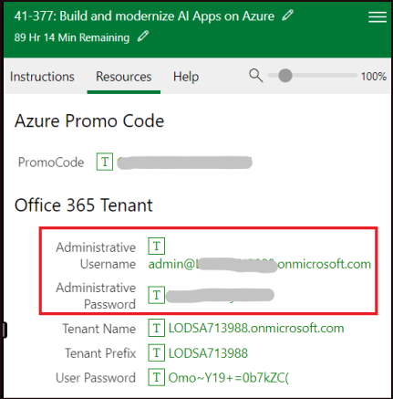
      

4.  Verify email id and then click on **Confirm Microsoft Account**.

      

5.  Paste the **promo code** from the Resources tab in the **Enter Promo
    code** box and click **Claim Promo Code**.

     

      

6.  It may take few seconds to process the redemption.

7.  Fill in the details appropriately on the **Sign up** page.

8.  On the **Agreement** window, select the check box - I agree to the
    subscription agreement, offer details, and privacy statement, and
    then click on **Sign up**.

    

9.  You may **Submit** the feedback while the account setup is in
    progress.

    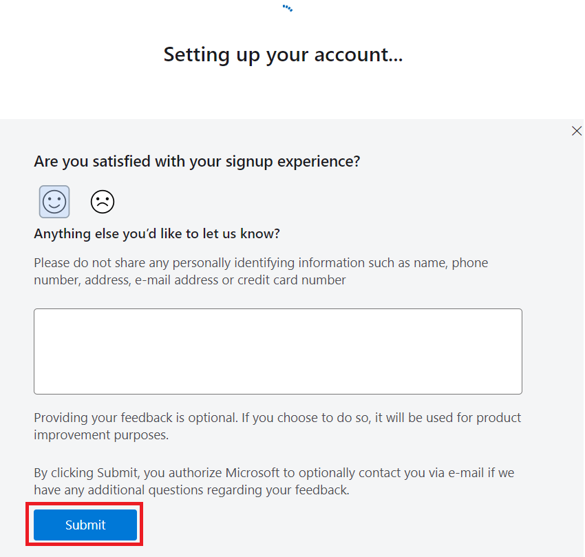
    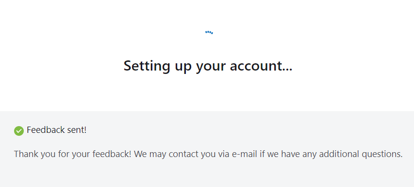

10. The account setup will take about 2-3 minutes to complete. It would
    automatically redirect you to the **Azure Portal** and now you are
    ready to use Azure services.

     

## **Task 1: Create a Fabric workspace**

In this task, you create a Fabric workspace. The workspace contains all
the items needed for this lakehouse tutorial, which includes lakehouse,
dataflows, Data Factory pipelines, the notebooks, Power BI datasets, and
reports.

1.  Open your browser, navigate to the address bar, and type or paste
    the following URL: +++https://app.fabric.microsoft.com/+++ then press the
    **Enter** button. In the **Microsoft Fabric Home** page, navigate
    and click on **Power BI** tile.

    

2.  In the **Power BI Home** page left-sided navigation menu, navigate
    and click on **Workspaces** as shown in the below image.

    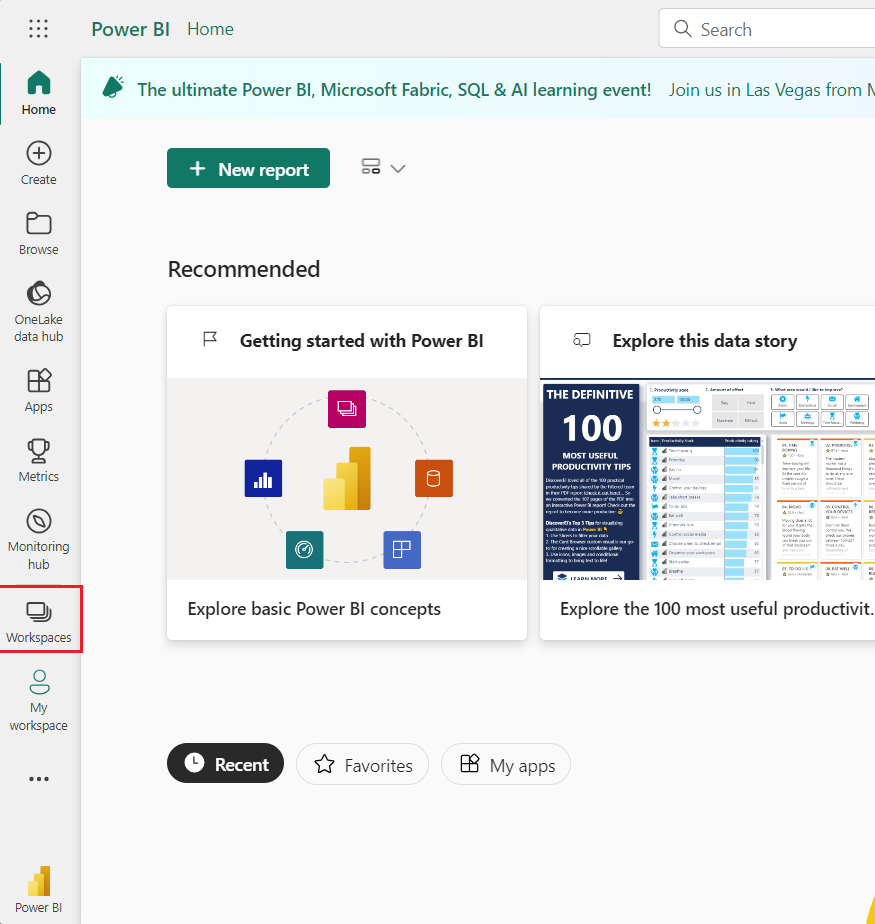

3.  In the Workspaces pane, click on **+** **New workspace button**

     

4.  In the **Create a workspace** pane that appears on the right side,
    enter the following details, and click on the **Apply** button.
    |  |  |
    |---|---|
    |Name|	+++RealTimeWorkspaceXXX+++ (XXX can be a unique number, you can add more numbers)|
    |Advanced|	Select Trail|
    |Default storage forma|	Small dataset storage format|

    
   
    
   
    

## **Task 2: Deploy the app via Azure Container Instance**

This task deploys the stock generator app to an Azure Container Instance
using an ARM template. The app will generate stock data that publishes
the data to an Azure Event Hub, which is also configured during the
deployment of the ARM template.

To auto-deploy the resources, use these steps below.

1.  Open a new address bar and enter the following URL. If prompted to
    Sign in, then use your tenant credentials.
+++https://portal.azure.com/#create/Microsoft.Template/uri/https%3A%2F%2Fraw.githubusercontent.com%2Fmicrosoft%2Ffabricrealtimelab%2Fmain%2Fresources%2Fmodule00%2Ffabricworkshop_arm_managedid.json+++

2.  In the **Custom deployment** window, under the **Basics** tab, enter
    the following details and click on the **Review+create** button.
    |  |  |
    |---|---|
    |Subscription|	Select the assigned subscription|
    |Resource group|	Click on Create new> enter +++realtimeworkshop+++ and select Ok|
    |Region	|Select West US 3|


    
    
    

4.  Once the validation has passed, click **Create**.

     

5.  After the deployment is completed, click on the **Go to resource**
    button.

      

4.  After the deployment has completed, open the resource group and
    verify the **Event Hub Namespace and Azure Container
    Instance (ACI)** is deployed

    

5.  Open the **Event Hub** **namespace**, which will have a name similar
    to **ehns-123456-fabricworkshop**.
      

6.  In **Event Hub** **namespace** page from the left menu select
    **Shared access policies** under the **Settings.**

      

7.   In the  **Shared access policies**  page, click
    the  **stockeventhub_sas**  .On the SAS key tab copy the **primary
    key** and **Event Hub namespace** (such
    as **ehns-123456-fabricworkshop**) to your notepad as this will be
    needed shortly. In short, you'll need the following:

      
      

## **Task 3: Get data with Eventstream**

1.  Go back to the Microsoft Fabric, navigate and click on **Power BI**
    at the bottom of the page, then select **Real-Time Intelligence**.

      

2.  On the **Synapse Real-Time Analytics** home page,
    select **Eventstream**. Name the Eventstream
    +++StockEventStream+++, click on the **Create** button.

      
      
      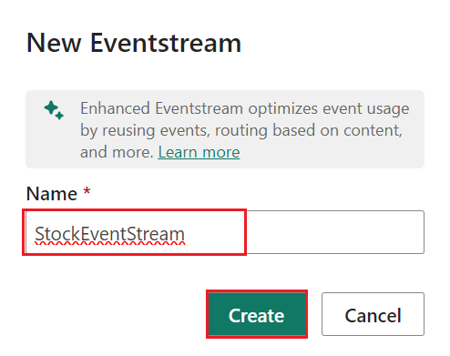

3.  On the Eventstream, select **Use external source**

      

4.  On the Add source, select **Azure *Event* Hubs** and click on
    **Connect** button.

      

5.  On the **Azure Event Hubs** configuration page, enter the below
    details and click on **Add** button.

      i.	Cloud connection: Click on the **Create new** and enter the below details then click on Create button.
    
            a.	In **Event Hub namespace**-Enter **Event Hub name** (the values that you have saved in your notepad in the **Task 2**)
            b.	Event Hub : +++StockEventHub+++
            c.	Shared Access Key Name:**+++stockeventhub_sas+++**
            d.	Shared Access Key- Enter **Primary Key** (the value that you have saved in your notepad in the Task 2)
    
      ii.	Consumer group: **$Default**
    
      iii.	Data format: **JSON**

      
      
      
      
      
      
      
      
      

8.  You will see a notification stating **Successfully added The source
    “StockEventHub,Azure Event Hubs”** was added.

     

9.  With the Event Hub configured, click on ***Test result***. You
    should see events including the stock symbol, price, and timestamp.

      

10. On the Eventstream, select **Publish.**

      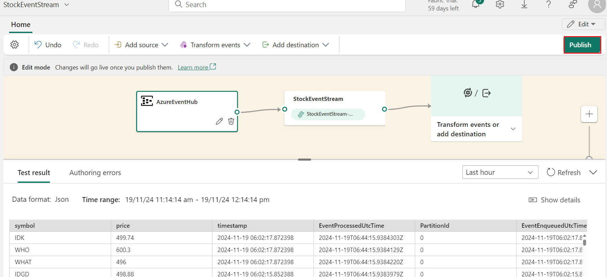

     

11. On the Eventstream, select **AzureEventHub** and click on
    **Refresh** button.

    
    
    

# Exercise 2: KQL Database Configuration and Ingestion

Now that our environment is fully configured, we will complete the
ingestion of the Eventstream, so that the data is ingested into a KQL
database. This data will also be stored in Fabric OneLake.

## Task 1: Create KQL Database

Kusto Query Language (KQL) is the query language used by Real-Time
analytics in Microsoft Fabric along with several other solutions, like
Azure Data Explorer, Log Analytics, Microsoft 365 Defender, etc. Similar
to Structured Query Language (SQL), KQL is optimized for ad-hoc queries
over big data, time series data, and data transformation.

To work with the data, we'll create a KQL database and stream data from
the Eventstream into the KQL DB.

1.  In the left-sided navigation menu, navigate and click on **RealTime
    workspaceXXX**, as shown in the below image.

      

2.  In the **Real-Time Intelligence** page, navigate to +**New item**
    section and select **Eventhouse** to create Eventhouse.

      

3.  In the **New Eventhouse** dialog box, enter +++StockDB+++in
    the **Name** field, click on the **Create** button and open the new
    Eventhouse.

      
      

4.  From the **System overview** page, select the **StockDB** database
    you created in the previous task.

      

5.  Select **StockDB**, click on the **OneLake availability** as shown
    in the below image to change the setting and, then click on the
    **Turn on** Toggle the button enable OneLake access.

      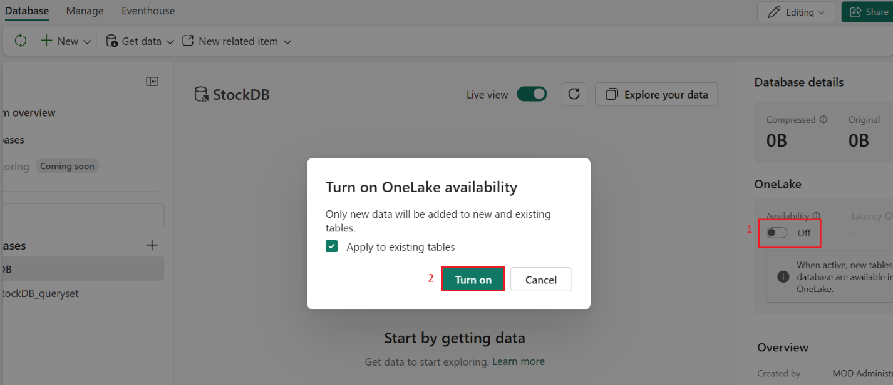
     
      

## Task 2: Send data from the Eventstream to the KQL database

1.  In the left-sided navigation menu, navigate and click on
    **StockEventStream** created in the previous task, as shown in the
    below image.

    

2.  On the Eventstream, click on the **Edit** button.

      

3.  Our data should be arriving into our Eventstream, and we'll now
    configure the data to be ingested into the KQL database we created
    in the above task. On the Eventstream, click on **Transform events
    or add destination***,* then navigate and click on **Eventhouse**.

      

4.  On the KQL settings, select **Direct ingestion**. While we have the
    opportunity to process event data at this stage, for our purposes,
    we will ingest the data directly into the KQL database. Set the
    destination name to +++KQL+++, then select your **workspace,
    Eventhouse** and KQL database created in the above task, then click
    on **Save** button.

      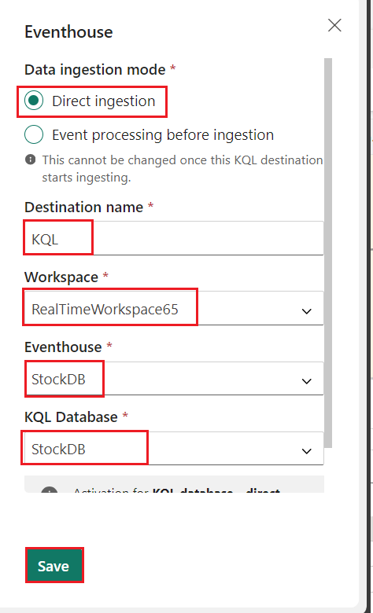
     

5.  On the Eventstream, select **Publish.**

      

6.  On the Eventstream pane, select **configure** in the **KQL**
    destination.

      

7.  On the first settings page, select **+New table** and enter the
    name +++StockPrice+++ for the table to hold the data in
    StockDB. Click on the **Next** button.

    
    

8.  The next page allows us to inspect and configure the schema. Be sure
    to change the format from TXT to **JSON**, if necessary. The default
    columns of *symbol*, *price*, and *timestamp* should be formatted as
    shown in the below image; then click on the **Finish** button.

    

9.  On the **Summary** page, if there are no errors, you’ll see a
    **green checkmark** as shown in the below image, then click on the
    **Close** button to complete the configuration.

      
      

10.  Click on the **Refresh** button

      

11. Select the **KQL** destination and click on the **Refresh** button.

     

     

# Exercise 3: Exploring the Data

In this exercise, you'll create several KQL queries of increasing
complexity to support different business uses.

## Task 1: Create KQL queryset: StockQueryset

1.  Click on **RealTimeWorkspace** on the left-sided navigation pane.

     

2.  From your workspace, click on **+** **New item \> KQL Queryset** as
    shown in the below image. In the **New KQL Queryset** dialog box,
    enter +++StockQueryset+++, then click on the **Create**
    button.

      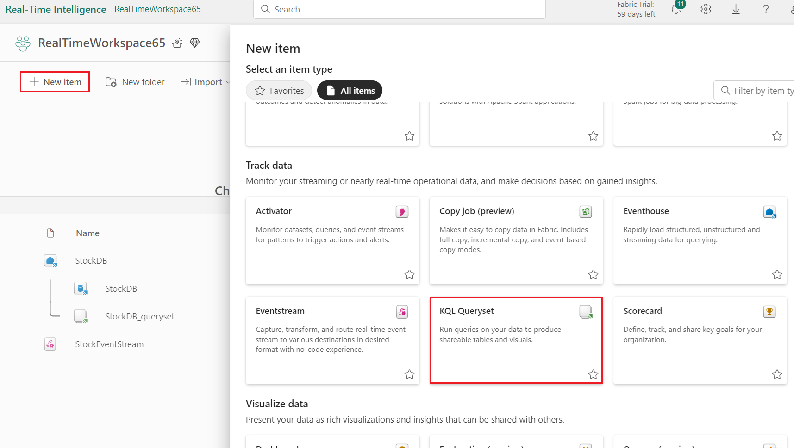
   
      

3.  Select the ***StockDB*** and click on the **Connect** button. ![A
      

4.  The KQL query window will open, allowing you to query the data.

     

5.  The default query code will look like the code shown in the below
    image; it contains 3 distinct KQL queries. You may
    see *YOUR_TABLE_HERE* instead of the ***StockPrice*** table. Select
    and delete them.

    

6.  In the query editor, copy and paste the following code. Select the
    entire text and click on *the **Run*** button to execute the query.
    After the query is executed, you will see the results.

      **Copy**
      ```
      // Use "take" to view a sample number of records in the table and check the data.
      StockPrice
      | take 100;
      
      // See how many records are in the table.
      StockPrice
      | count;
      
      // This query returns the number of ingestions per hour in the given table.
      StockPrice
      | summarize IngestionCount = count() by bin(ingestion_time(), 1h);
      ```

       **Note:** To run a single query when there are multiple queries in the
      editor, you can highlight the query text or place your cursor so the
      cursor is in the context of the query (for example, at the beginning or
      end of the query) -- the current query should highlight in blue. To run
      the query, click Run in the toolbar. If you'd like to run all 3 to
      display the results in 3 different tables, each query will need to have
      a semicolon (;) after the statement, as shown below.*

      

7.  The results will be displayed in 3 different tables as shown in the
    below image. Click on each table tab to review the data.

      
    
      
     
      

## Task 2: New Query of StockByTime

1.  Create a new tab within the queryset by clicking on the ***+* icon**
    as shown in the below image. Rename this tab as
    **+++StockByTime+++**

      
     
      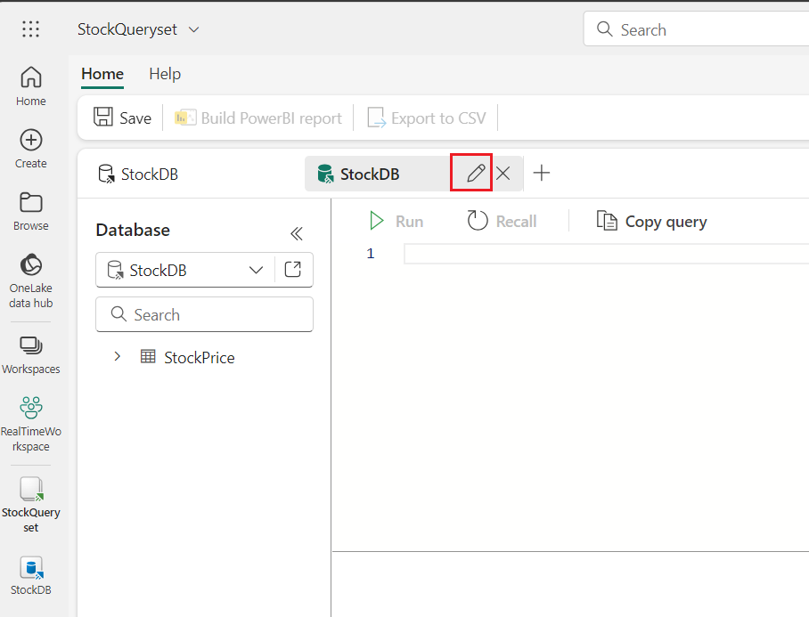
     
      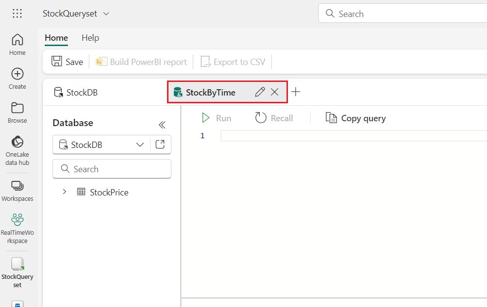

2.  We can begin to add our own calculations, such as calculating the
    change over time. For example,
    the [prev()](https://learn.microsoft.com/en-us/azure/data-explorer/kusto/query/prevfunction) function,
    a type of windowing function, allows us to look at values from
    previous rows; we can use this to calculate the change in price. In
    addition, as the previous price values are stock symbol specific, we
    can [partition](https://learn.microsoft.com/en-us/azure/data-explorer/kusto/query/partition-operator) the
    data when making calculations.

3.  In the query editor, copy and paste the following code. Click on
    the **Run** button to execute the query. After the query is
    executed, you will see the results.

      Copy
      ```
      StockPrice
      | where timestamp > ago(75m)
      | project symbol, price, timestamp
      | partition by symbol
      (
          order by timestamp asc
          | extend prev_price = prev(price, 1)
          | extend prev_price_10min = prev(price, 600)
      )
      | where timestamp > ago(60m)
      | order by timestamp asc, symbol asc
      | extend pricedifference_10min = round(price - prev_price_10min, 2)
      | extend percentdifference_10min = round(round(price - prev_price_10min, 2) / prev_price_10min, 4)
      | order by timestamp asc, symbol asc
      ```

      

4.  In this KQL query, the results are first limited to the most recent
    75 minutes. While we ultimately limit the rows to the last 60
    minutes, our initial dataset needs enough data to lookup previous
    values. The data is then partitioned to group the data by symbol,
    and we look at the previous price (from 1 second ago) as well as the
    previous price from 10 minutes ago. Note that this query assumes
    data is generated at 1 second intervals. For the purposes of our
    data, subtle fluctuations are acceptable. However, if you need
    precision in these calculations (such as exactly 10 minutes ago and
    not 9:59 or 10:01), you'd need to approach this differently.

## Task 3: StockAggregate

1.  Create another new tab within the queryset by clicking on
    the  **+** **icon** as shown in the below image. Rename this tab as
    **+++StockAggregate+++**

      
     
      

2.  This query will find the biggest price gains over a 10-minute period
    for each stock, and the time it occurred. This query uses
    the [summarize](https://learn.microsoft.com/en-us/azure/data-explorer/kusto/query/summarizeoperator) operator,
    which produces a table that aggregates the input table into groups
    based on the specified parameters (in this case, *symbol*),
    while [arg_max](https://learn.microsoft.com/en-us/azure/data-explorer/kusto/query/arg-max-aggregation-function) returns
    the greatest value.

3.  In the query editor, copy and paste the following code. Click on
    the **Run** button to execute the query. After the query is
    executed, you will see the results.

      **Copy**
      ```
      StockPrice
      | project symbol, price, timestamp
      | partition by symbol
      (
          order by timestamp asc
          | extend prev_price = prev(price, 1)
          | extend prev_price_10min = prev(price, 600)
      )
      | order by timestamp asc, symbol asc
      | extend pricedifference_10min = round(price - prev_price_10min, 2)
      | extend percentdifference_10min = round(round(price - prev_price_10min, 2) / prev_price_10min, 4)
      | order by timestamp asc, symbol asc
      | summarize arg_max(pricedifference_10min, *) by symbol
      ```
      

## Task 4: StockBinned

1.  Create another new tab within the queryset by clicking on
    the ***+ icon** as shown in the below image. Rename this tab as
    **+++ StockBinned+++**

      
      
      

2.  KQL also has a [bin()
    function](https://learn.microsoft.com/en-us/azure/data-explorer/kusto/query/bin-function),
    which can be used to bucket results based on the bin parameter. In
    this case, by specifying a timestamp of 1 hour, the result is
    aggregated for each hour. The time period can be set to minute,
    hour, day, and so on.

3.  In the query editor, copy and paste the following code. Click on
    the **Run** button to execute the query. After the query is
    executed, you will see the results.
     **Copy**
    ```
    StockPrice
    | summarize avg(price), min(price), max(price) by bin(timestamp, 1h), symbol
    | sort by timestamp asc, symbol asc
    ```
      

4.  This is particularly useful when creating reports that aggregate
    real-time data over a longer time period.

## Task 5: Visualizations

1.  Create a final new tab within the queryset by clicking on
    the ***+* icon** as shown in the below image. Rename this tab as
    **+++Visualizations+++**. We'll use this tab to explore
    visualizing data.

    
   
    

2.  KQL supports a large number
    of [visualizations](https://learn.microsoft.com/en-us/azure/data-explorer/kusto/query/render-operator?pivots=fabric) by
    using the *render* operator. Run the below query, which is the same
    as the StockByTime query, but with an additional *render* operation
    added:

3.  In the query editor, copy and paste the following code. Click on
    the **Run** button to execute the query. After the query is
    executed, you will see the results.

       Copy
      ```
      StockPrice
      | where timestamp > ago(75m)
      | project symbol, price, timestamp
      | partition by symbol
      (
          order by timestamp asc
          | extend prev_price = prev(price, 1)
          | extend prev_price_10min = prev(price, 600)
      )
      | where timestamp > ago(60m)
      | order by timestamp asc, symbol asc
      | extend pricedifference_10min = round(price - prev_price_10min, 2)
      | extend percentdifference_10min = round(round(price - prev_price_10min, 2) / prev_price_10min, 4)
      | order by timestamp asc, symbol asc
      | render linechart with (series=symbol, xcolumn=timestamp, ycolumns=price)
      ```
     

4.  This will render a line chart as shown in the below image.

       

# Exercise 4: Optimizing Power BI Reporting Efficiency

With the data loaded in the database and our initial KQL queryset
complete, we can begin to craft visualizations for real-time dashboards.

## Task 1: Configuring Refresh Rate

Our Power BI tenant needs to be configured to allow for more frequent
updating.

1.  To configure this setting, navigate to the Power BI admin portal by
    clicking on the ***Settings* **icon in the upper right corner of the
    **Fabric portal**. Navigate to Governance and insights section, then
    click on **Admin portal**.

      

2.  Select ***Capacity settings*** on the left, and select the **Trial**
    that matches your current environment. Select **Trial** name

      

3.  On the following screen, scroll down to the **Power BI
    workloads** section, and under **Semantic Models**  (recently
    renamed from **Datasets**), configure  **Automatic page
    refresh** to **On**, with a **minimum refresh interval** of **1**
    second. Click **Apply**

    Note: depending on your administrative permissions, this setting may not
    be available. Note that this change may take several minutes to
    complete.

    
    
    

4.  In caseUpdate your capacity workloads dialog box appears, then click
    on the **Yes** button.

     

## Task 2: Creating a basic Power BI report

1.  In the **Microsoft Fabric** page menu bar on the left side, select
    **StockQueryset**.

    

2.  From the  **StockQueryset**  queryset used in the previous module,
    select the  **StockByTime**  query tab.

      

3.  Select the query and run to view the results. Click on the
    **Build Power BI report*** button in the command bar to bring this
    query into Power BI.

     

     

4.  On the report preview page, we can configure our initial chart,
    select a **line chart** to the design surface, and configure the
    report as follows. See the image below as a reference.

      - Legend: **symbol**
      
      - X-axis: **timestamp**
      
      - Y-axis: **price**
  
      

5.  In the Power BI (preview) page, from the ribbon, click on
    **File** and select **Save**.

      

6.  On **Just a few details first** dialog box, in **Name your file in
    Power BI** field, enter +++RealTimeStocks+++. In **Save it to
    a workspace** field, click on the dropdown and select
    ***RealTimeWorkspace***. Then, click on the **Continue** button.

      

7.  In the Power BI (preview) page, click on **Open the file in Power BI
    to view, edit and get a shareable link.**

      

8.  On the **RealTimeStock** page, click on the **Edit** button in the
    command bar to open the report editor.

     

9.  Select the line chart on the report. Configure a **Filter**
    for ***timestamp*** to display data for the last 5 minutes using
    these settings:

      - Filter type: Relative time
      
      - Show items when the value: is in the last 5 minutes

      Click on ***Apply filter*** to enable the filter. You will see a
      similar type of output as shown in the below image.

       

## Task 3: Creating a second visual for percent change

1.  Create a second line chart, under **Visualizations**, select **Line
    chart**.

2.  Instead of plotting the current stock price, select
    the ***percentdifference_10min*** value, which is a positive or
    negative value based off the difference between the current price
    and the value of the price from 10 minutes ago. Use these values for
    the chart:

      - Legend: **symbol**
      
      - X-axis: **timestamp**
      
      - Y-axis: **average of percentdifference_10min**

      

      

3.  Under the **Visualization,** select the **Analytics** represented by
    a magnifier-like icon as shown in the below image, then click on
    **Y-Axis Constant Line(1).** In the **Apply settings to**
    section , click on **+Add line,** then enter **Value 0.**

      

4.  Select the line chart on the report. Configure a **Filter**
    for **timestamp** to display data for the last 5 minutes using
    these settings:

    - Filter type: Relative time
    
    - Show items when the value: is in the last **5** minutes
    
    

## Task 4: Configuring the report to auto-refresh

1.  Deselect the chart. On the  **Visualizations** settings ,
    enable ***Page refresh*** to automatically refresh every second or
    two, based on your preference. Of course, realistically we need to
    balance the performance implications of refresh frequency, user
    demand, and system resources.

2.  Click on **Format your report** **page** icon, navigate and click on
    **Page refresh**. Turn on the toggle. Set the Auto page refresh
    value as **2 Seconds** as shown in the below image.

      

3.  In the Power BI (preview) page, from the ribbon, click on
    **File** and select **Save**.

    

# Exercise 5: Setting up the Lakehouse

## Task 1: Create the Lakehouse

Start by creating a Lakehouse.

***Note**: If you are completing this lab after the data science module
or another module that uses a Lakehouse, you may re-use that Lakehouse
or create a new one, but we'll assume the same Lakehouse is shared
across all modules.*

1.  Within your Fabric workspace, switch to the **Data engineering**
    persona (bottom left) as shown in the below image.

      

2.  In Synapse Data Engineering Home page, navigate and click on
    **Lakehouse**tile.

     

3.  In the **New lakehouse** dialog box, enter
    +++StocksLakehouse+++ in the **Name** field, then click on the
    **Create** button. A **StocksLakehouse** page will appear.

      
      

4.  You will see a notification stating - **Successfully created SQL
    endpoint**.

    **Note**: In case, you did not see the Notifications, then wait for
     few minutes.

     

## **Task 2. Add Lakehouse to the Eventstream**

From an architecture perspective, we'll implement a [Lambda
architecture](https://en.wikipedia.org/wiki/Lambda_architecture) by
splitting hot path and cold path data from the Eventstream. Hot path
will continue to the KQL database as already configured, and cold path
will be added to write the raw data to our lakehouse. Our data flow will
resemble the following:

1.  Now, click on **RealTimeWorkspace** on the left-sided navigation
    pane and select **StockEventStream** as shown in the below image.

       

2.  In addition to adding Lakehouse to the Eventstream, we'll do some
    cleanup of the data using some of the functions available in the
    Eventstream.

3.  On the **StockEventStream** page, select **Edit**

    

4.  On the **StockEventStream** page, click on the **Add destination**
    on the output of the Eventstream to add a new destination.
    Select **Lakehouse**from the context menu.

      

5.  In the Lakehouse pane that appears on the right side, enter the
    following details and click on **Save.**

      |  |   |
      |---|---|
      |Destination name|	+++Lakehouse+++|
      |Workspace	|RealTimeWorkspace|
      |Lakehouse|	StockLakehouse|
      |Delta table|	Click on Create new> enter +++raw_stock_data+++|
      |Input data format|	Json|


     
    
     

6.  Connect **StockEventStream** and **Lakehouse**

     
     
   
     
   
     

7.  Select the Lakehouse and click on **Refresh** button

     

8.  After clicking **Open event processor**, various processing can be
    added that perform aggregations, filtering, and changing datatypes.

     

9.  On the **StockEventStream** page, select **Edit**

     

10.  On the **StockEventStream** page, select **stockEventStream**, and
    click the **Insert a node** icon to add a **Mange field**. Then,
    select **Mange field.**

     
     
      

11. In the eventstreem pane select **Managefields** pencil icon.

    

12. In the ***Manage fields*** pane that opens, click ***Add all
    fields*** to add all columns. Then, remove the fields
    **EventProcessedUtcTime**, **PartitionId**, and
    **EventEnqueuedUtcTime** by clicking the **ellipsis (...)** to the
    right of the field name, and click **Remove** 

     
    
     

     
      
      

13. Now change the  **timestamp**  column to a **DateTime**as it is
    likely classified as a string. Click the **three ellipsis (...)** to
    the right of the  **timestamp  column** and select  **Yes** change
    type*. This will allow us to change the datatype:
    select **DateTime**,as shown in the below image. Click on
    **Done**

      
      

14. Now, click on the **Publish** button to close the event processor

      
     
      

13. Once it is completed, the Lakehouse will receive the symbol, price,
    and timestamp.

    

    Our KQL (hot path) and Lakehouse (cold path) is now configured. It may
    take a minute or two for data to be visible in the Lakehouse.

## Task 3. Import notebooks

**Note**: If you have issues importing these notebooks, be sure you are
downloading the raw notebook file and not the HTML page from GitHub that
is displaying the notebook.

1.  Now, click on **RealTimeWorkspace** on the left-sided navigation
    menu.

    

2.  In the **Synapse Data Engineering** **RealTimeWorkspace** page,
    navigate and click on **-\>|Import** button, then select
    **Notebook** and select **From this computer** as shown in the below
    image.

      

3.  Select **Upload** from the **Import status** pane that appears on
    the right side of the screen.

      

4.  Navigate and select **Lakehouse 1-Import Data, Lakehouse 2-Build
    Aggregation, Lakehouse 3-Create Star Schema** and **Lakehouse 4-Load
    Star Schema** notebooks from **C:\LabFiles\Lab 04** and click on the
    **Open** button.

      

5.  You will see a notification stating **Imported successfully.**

      )

## Task 4. Import additional data

In order the make the reports more interesting, we need a bit more data
to work with. For both the Lakehouse and Data Science modules,
additional historical data can be imported to supplement the data that
is already ingested. The notebook works by looking at the oldest data in
the table, prepending the historical data.

1.  In the **RealTimeWorkspace** page, to view only the notebooks, click
    on the **Filter** at the top right corner of the page, then select
     **Notebook.** 

    

2. Then , select the **Lakehouse 1 - Import Data**notebook.

     

3.  Under **Explorer**, navigate and select the **Lakehouse**, then
    click on the **Add** button as shown in the below images.

    ***Important Note***: You’ll need to add the Lakehouse to every
       imported notebook -- do this each time you open a notebook for the
       first time.
 
      
    
      

4.  In the **Add Lakehouse** dialog box, select the **Existing
    lakehouse** **without Schema** radio button, then click on the
    **Add** button.

    

5.  On the **OneLake data hub** window, select  **StockLakehouse**  and
    click on the **Add** button.
     

7.  The  **raw_stock_data** table was created when the Eventstream was
    configured, and is the landing place for the data that is ingested
    from the Event Hub.

     

    **Note**: You will see the **Run** button when you hover your mouse over
    the cell in the notebook.

8.  To start the notebook and execute the cell, select the **Run** icon
    that appears on the left side of the cell.

     

9.  To download and unzip historical data to the lakehouse unmanaged
    files, run the 2^(nd) and 4^(th) cells.

      
     
      
      

10.  Create the target table if it doesn't exist; find minimum date in
    the table to act as a cut-off point., select and run the 5^(th)
    cell.

      

11. Run the 6^(th) cell, 7^(th) cell

      
     
      

    **Important**:While verifying CSV files, if you encounter the error
    shown below, restart the kernel and run the cell again. 

6.  Loads the data and filters out data outside the timeframe window.
    select and run the 8^(h) cell and 9^(th) cell.

    
    
    

11. While similar to 'commenting out' sections of code, freezing cells
    is powerful in that any output of the cells are also preserved.

    
    
    

# Exercise 6: Building the Aggregation Tables

In this exercise, you’ll build curated and aggregated data suitable for
use in building our dimensional model and in data science. With the raw
data having a per-second frequency, this data size is often not ideal
for reporting or analysis. Further, the data isn't cleansed, so we're at
risk of non-conforming data causing issues in reports or pipelines where
erroneous data isn't expected. These new tables will store the data at
the per-minute and per-hour level. Fortunately, *data wrangler* makes
this an easy task.

The notebook used here will build both aggregation tables, which are
silver-level artifacts. While it is common to separate medallion layers
into different Lakehouses, given the small size of our data and for the
purposes of our lab, we'll be using the same Lakehouse to store all
layers.

## *Task 1: Build Aggregation Tables* notebook

Take a moment to scroll through the notebook. Be sure to add the default
Lakehouse if it is not already added.

1.  Now, click on **RealTimeWorkspace** on the left-sided navigation
    menu.

    

2.   In the **RealTimeWork space** page, click on  **Lakehouse 2 –
    Build Aggregation Tables**  notebook.

      

3.  Under Explorer, navigate and select the **Lakehouse**, then click on
    the **Add** button.

      
      

4.  In the **Add Lakehouse** dialog box, select the **Existing lakehouse
    without Schema** dialog box, then click on the **Add** button.

      

5.  On the **OneLake data hub** window, select the **StockLakehouse**,
    and click on the **Add** button.

      

6.  To build Aggregate Tables, select and run the 1^(st) , 2^(nd) ,
    3^(rd) , and 4^(th) cells.

     
     
     
     
7.  Then, select and run the 5^(th) , 6^(th), 7^(th) , and 8^(th) cells.

    
    
    
    

8.  Add data wrangler, select **9^(th)** cell, navigate dropdown **Data
    Wrangler**. Navigate and click on **anomaly_df** to load the
    dataframe in data wrangler . 

9.  We'll use the **anomaly_df** because it was intentionally created with
    a few invalid rows that can be tested. 

      

10. In data wrangler, we'll record a number of steps to process data.
    Notice the data is visualized in the central column. Operations are
    in the top left, while an overview of each step is in the
    bottom left.

     

11. To remove null/empty values, under **Operations,** click on the
    dropdown beside  **Find and replace** , then navigate and click on
     **Drop missing values** .

    

12. From the ***Target columns*** dropdown, select
    the ***symbol*** and ***price* **columns and then click on ***Apply
    button** below it as shown in the image . 

    
    
    

13. Under  **Operations**  dropdown, navigate and click on  **Sort and
    filter** , then click on  **Filter** as shown in the below image . 

    

14. **Uncheck**  Keep matching rows , select  **price**  as the target
    column, and set the condition to  **Equal** to **0**.
    Click **Apply**in the *Operations* panel beneath the Filter

    Note: The rows with zero are marked red as they will be dropped (if
    the other rows are marked red, ensure to uncheck the **Keep matching
     rows** checkbox).

      )
      

15. Click on **+ Add code to notebook*** in the upper left side of the
    page. On the  **Add code to notebook** window, ensure that  Include
    pandas code is unchecked and click on the ***Add** button. 

     
      

16. The code inserted will look similar to the below.

     

17. Run the cell and observe the output. You’ll observe that the invalid
    rows were removed.

     
      

    The function created, *clean_data*, contains all of the steps in
    sequence and can be modified as needed. Notice that each step performed
    in data wrangler is commented. Because data wrangler was loaded with
    the *anomaly_df*, the method is written to take that dataframe by name,
    but this can be any dataframe that matches the schema.

18. Modify the function name
    from ***clean_data*** to **remove_invalid_rows**, and change the
    line **anomaly_df_clean = clean_data(anomaly_df)** to **df_stocks_clean
    = remove_invalid_rows(df_stocks)** . Also, while not necessary for
    functionality, you can change the name of the dataframe used in the
    function to simply **df** as shown below

19. Run this cell and observe the output.
      ```
      # Code generated by Data Wrangler for PySpark DataFrame
      
      def remove_invalid_rows(df):
          # Drop rows with missing data in columns: 'symbol', 'price'
          df = df.dropna(subset=['symbol', 'price'])
          # Filter rows based on column: 'price'
          df = df.filter(~(df['price'] == 0))
          return df
      
      df_stocks_clean = remove_invalid_rows(df_stocks)
      display(df_stocks_clean)
      ```
      
      

20. This function will now remove the invalid rows from
    our **df_stocks** dataframe and return a new dataframe
    called **df_stocks_clean**. It is common to use a different name for
    the output dataframe (such as **df_stocks_clean**) to make the cell
    idempotent -- this way, we can go back and re-run the cell, make
    modifications, etc., without having to reload our original data.

     

## Task 2: Build aggregation routine

In this task, you’ll be more involved because we'll build a number of
steps in data wrangler, adding derived columns and aggregating the data.
If you get stuck, continue as best you can and use the sample code in
the notebook to help fix any issues after.

1.  Add new column datestamp in the  **Symbol/Date/Hour/Minute
    Aggregation** Section*, place your cursor in the  **Add data wrangler
    here** cell and select the cell. Dropdown the **Data Wrangler**.
    Navigate and click on **df_stocks_clean** as shown in the below
    image.
      
      
      

2.  In **Data Wrangler:df_stocks_clean** pane, select **Operations**,
    then select **New column by example.**

    

3.  Under  **Target columns**  field, click on the dropdown and select
     **timestamp** . Then, in the  **Derived column**  name  field,
    enter **+++datestamp+++** 

     

4.  In the new  **datestamp**  column, enter an example value for any
    given row. For example, if the **timestamp** is **2024-02-07
    09:54:00** enter  **2024-02-07** . This allows data wrangler to infer
    we are looking for the date without a time component; once the
    columns autofill, click on the ***Apply*** button.

      
      

5.  Similar to adding the ***datestamp*** column as mentioned in the
    above steps, click again on **New column by example** as shown in
    the below image.

    

6.  Under **Target columns**, choose  **timestamp** . Enter a  **Derived
    column** name  of +++hour+++ 

     
7.  In the new ***hour***column that appear in the data preview, enter
    an hour for any given row -- but try to pick a row that has a unique
    hour value. For example, if the *timestamp* is *2024-02-07
    09:54:00* enter ***9***. You may need to enter example values for
    several rows, as shown here. Click on **Apply** button.

     

8.  Data wrangler should infer we are looking for the hour component,
    and build code similar to:

    # Derive column 'hour' from column: 'timestamp'
    def hour(timestamp):
        """
        Transform based on the following examples:
           timestamp           Output
        1: 2024-02-07T09:54 => "9"
        """
        number1 = timestamp.hour
        return f"{number1:01.0f}"
    
    pandas_df_stocks_clean.insert(3, "hour", pandas_df_stocks_clean.apply(lambda row : hour(row["timestamp"]), axis=1))

     

 9.  Same as with the hour column, create a new ***minute* **column. In
    the new *minute* column, enter a minute for any given row. For
    example, if the *timestamp* is *2024-02-07 09:54:00* enter *54*. You
    may need to enter example values for several rows.

     

10. The code generated should look similar to:

      # Derive column 'minute' from column: 'timestamp'
      def minute(timestamp):
          """
          Transform based on the following examples:
             timestamp           Output
          1: 2024-02-07T09:57 => "57"
          """
          number1 = timestamp.minute
          return f"{number1:01.0f}"
      
      pandas_df_stocks_clean.insert(3, "minute", pandas_df_stocks_clean.apply(lambda row : minute(row["timestamp"]), axis=1))

      

11. Next, convert the hour column to an integer. Click on the **ellipsis
    (...)** in the corner of the **hour** column and select  **Change
    column** type . Click on the dropdown beside  **New type** ,
    navigate and select  **int32**,  then click on the  **Apply
    button**  as shown in the below image.
      

     
12. Convert the minute column to an integer using the same steps as you
    just performed for the hour. Click on the **ellipsis (...)** in the
    corner of the ***minute column** and select  **Change column**
    type . Click on the dropdown beside ***New type** , navigate and
    select  **int32**,  then click on the  **Apply button**  as shown in
    the below image.

    
    
    

13. **Now, under the Operations section, navigate and click on *Group by
    and aggregate*** as shown in the below image.

    

14. Click on the dropdown under ***Columns to group by*** field and
    select **symbol**, **datestamp**, **hour**, **minute**.

    
15. Click on +*Add aggregation*, create a total of three aggregations as
    shown in the below images and click on the  **Apply**  button.

    - price: Maximum
    
    - price: Minimum
    
    - price: Last value

     
      

16. Click  **Add code to notebook**  in the upper left corner of the
    page. On the **Add code to notebook** window, ensure  Include
    pandas code  is unchecked, then click on the  **Add** button. 

      
      
      

13.  **Review the code**, in the cell that is added, in the last two
    lines of the cell, notice the dataframe returned is
    named  **df_stocks_clean_1** . Rename
    this ***df_stocks_agg_minute***, and change the name of the function
    to ***aggregate_data_minute*** as shown below.
    ```
     **# old:**
      def clean_data(df_stocks_clean):
        ...
      
      df_stocks_clean_1 = clean_data(df_stocks_clean)
      display(df_stocks_clean_1)
      
      **# new:**
      def aggregate_data_minute(df_stocks_clean):
        ...
      
      df_stocks_agg_minute = aggregate_data_minute(df_stocks_clean)
      display(df_stocks_agg_minute)
    ```
    

14. Code generated by Data Wrangler for PySpark DataFrame cell, select
    the **Run** icon that appears to the left of the cell upon hover.

    
    
    


    **Note**: If you get stuck, refer to the commented-out code as a
    reference. If any of the data wrangling steps don't seem to be quite
    correct (not getting the correct hour or minute, for example), refer to
    the commented-out samples. Step 7 below has a number of additional
    considerations that may help.

    **Note:** If you'd like to comment-out (or uncomment) large blocks, you
    can highlight the section of code (or CTRL-A to select everything in the
    current cell) and use CTRL-/ (Control *slash*) to toggler commenting.

15. In the merge cell, select the **Run** icon that appears to the left
    of the cell upon hover. The merge function writes the data into the
    table:
    ```
    # write the data to the stocks_minute_agg table
    
    merge_minute_agg(df_stocks_agg_minute)
    ```

     

## Task 3: Aggregate hourly

Let's review current progress - our per-second data has been cleansed,
and then summarized to the per-minute level. This reduces our rowcount
from 86,400 rows/day to 1,440 rows/day per stock symbol. For reports
that might show monthly data, we can further aggregate the data to
per-hour frequency, reducing the data to 24 rows/day per stock symbol.

1.  In the final placeholder under the *Symbol/Date/Hour* section, load
    the existing ***df_stocks_agg_minute*** dataframe into data
    wrangler.

2.  In the final placeholder under the ***Symbol/Date/Hour*** section,
    place your cursor in the Add data wrangler here cell and select
    the cell. Dropdown the **Data Wrangler,** navigate and click on
    ***df_stocks_agg_minute*** as shown in the below image.

     
      

3.  Under ***Operations*,** select ***Group by and aggregate***. Click
    on the dropdown below **Columns to group by** field and select
    ***symbol*, *datestamp*, and *hour***, and then click on **+Add
    aggregations**. Create the following three aggregations and click on
    Apply button below it, as shown in the below image.

      - price_min: Minimum
      
      - price_max: Maximum
      
      - price_last: Last value

     
      

4.  Example code is shown below. In addition to renaming the function
    to *aggregate_data_hour*, the alias of each price column has also
    been changed to keep the column names the same. Because we are
    aggregating data that has already been aggregated, data wrangler is
    naming the columns like price_max_max, price_min_min; we will modify
    the aliases to keep the names the same for clarity.

     

5.  Click ***Add code to notebook*** in the upper left corner of the
    page. On the ***Add code to notebook** window, ensure  Include
    pandas code  is unchecked and click on the  **Add** button. 

      
      
      

16. In the cell that is added, in the last two lines of the cell, notice
    the dataframe returned is named def
    clean_data(df_stocks_agg_minute):, rename this

    **def aggregate_data_hour(df_stocks_agg_minute):**

17. In the cell that is added, in the last two lines of the cell, notice
    the dataframe returned is named **df_stocks_agg_minute_clean =
    clean_data(df_stocks_agg_minute)**. Rename this **df_stocks_agg_hour
    = aggregate_data_hour(df_stocks_agg_minute),** and change the name
    of the function **display(df_stocks_agg_minute_clean)**
    to **aggregate_data_minute**, as shown below. 
      ```
      **Reference Code:** 
      # Code generated by Data Wrangler for PySpark DataFrame
      
      from pyspark.sql import functions as F
      
      def aggregate_data_hour(df_stocks_agg_minute):
          # Performed 3 aggregations grouped on columns: 'symbol', 'datestamp', 'hour'
          df_stocks_agg_minute = df_stocks_agg_minute.groupBy('symbol', 'datestamp', 'hour').agg(
              F.max('price_max').alias('price_max'), 
              F.min('price_min').alias('price_min'), 
              F.last('price_last').alias('price_last'))
          df_stocks_agg_minute = df_stocks_agg_minute.dropna()
          df_stocks_agg_minute = df_stocks_agg_minute.sort(df_stocks_agg_minute['symbol'].asc(), df_stocks_agg_minute['datestamp'].asc(), df_stocks_agg_minute['hour'].asc())
          return df_stocks_agg_minute
      
      df_stocks_agg_hour = aggregate_data_hour(df_stocks_agg_minute)
      display(df_stocks_agg_hour)
      
      ```
     

18. Select and **Run** the cell.

     

19. The code to merge the hour aggregated data is in the next cell:
    **merge_hour_agg(df_stocks_agg_hour)**

20. Run the cell to complete the merge. There are a few utility cells at
    the bottom for checking the data in the tables -- explore the data a
    bit and feel free to experiment.

     

21. Use **Handy SQL Commands for testing** section for testing, cleaning
    out tables to re-run, etc. Select and **Run** the cells in this
    section.

     
      
       

# Exercise 7: Building the Dimensional Model

In this exercise, we'll further refine our aggregation tables and create
a traditional star schema using fact and dimension tables. If you've
completed the Data Warehouse module, this module will produce a similar
result, but is different in approach by using notebooks within a
Lakehouse.

**Note**: It is possible to use pipelines to orchestrate activities, but
this solution will be done completely within notebooks.

## Task 1: Create schema

This run-once notebook will setup the schema for building the fact and
dimension tables. Configure the sourceTableName variable in the first
cell (if needed) to match the hourly aggregation table. The begin/end
dates are for the date dimension table. This notebook will recreate all
tables, rebuilding the schema: existing fact and dimension tables will
be overwritten.

1.  Click on **RealTimeWorkspace** on the left-sided navigation menu.

      

2.   In the RealTimeWorkshop  workspace, select the  **Lakehouse 3 –
    Create Star Schema** notebook.
    

3.  Under the Explorer, navigate and click on the **Lakehouses**, then
    click on the  **Add** button. 

     
      

4.  In the **Add Lakehouse** dialog box, select the **Existing
    lakehouse** radio button, then click on the **Add** button.

     

5.  On the OneLake data hub window, select ***StockLakehouse***  and
    click on the **Add** button.

     

6.  With the notebook loaded and the Lakehouse attached, notice the
    schema on the left. In addition to the **raw_stock_data** table,
    there should be the **stocks_minute_agg** and **stocks_hour_agg**
    tables.

     

7.  Run each cell individually by clicking the **play** button on the
    left side of each cell to follow along with the process.

       
       
       
       
        
        
         
         
         
      
8.  When all cells have been run successfully, navigate to
    **StocksLakehouse** section, click on the horizontal ellipsis beside
    **Tables** **(...)**, then navigate and click on ***Refresh** as
    shown in the below image .

     

9.  Now, you can see all additional tables ***dim_symbol*, *dim_date*,
    and *fact_stocks_daily_prices*** for our dimensional model.

     

## Task 2: Load fact table

Our fact table contains the daily stock prices (the high, low, and
closing price), while our dimensions are for our date and stock symbols
(which might contain company details and other information). Although
simple, conceptually, this model represents a star schema that can be
applied to larger datasets.

1.  Now, click on **RealTimeWorkspace** on the left-sided navigation
    menu.

     

2.   In the RealTimeWorkshop  workspace, select the  **Lakehouse 4 –
    Load fact table**  notebook.

     

3.  Under the Explorer, select **Lakehouse**, then click on the ***Add**
    button. 

     
    
     

4.  In the **Add Lakehouse** dialog box, select the **Existing
    lakehouse** radio button, then click on the **Add** button.

     

5.  On the OneLake data hub tab, select the ***StockLakehouse***  and
    click on the **Add** button.

     

6.  Select and run each cell individually.

     

7.  Function adds symbols to dim_symbol that may not exist in table,
    select and **Run** the 2^(nd) and 3^(rd) cells.

    
    

8.  To get new stock data to ingest, starting at watermark, select and
    run the 4^(th) cell.

    

9.  Load the date dimension for later joins, select and **Run** the
    5^(th), 6^(th), and 7^(th) cells.

    
    
    
    

10. To join the aggregated data to the date dimension, select and
    **Run** the 8^(th) and 9^(th) cells.

    
    
11. Create a final view with cleaned names for processing ease, select
    and **Run** the 10^(th), 11^(th) , and 12^(th) cells.

    
    
    

12. To obtain the result and plot a graph, select and **Run** 13^(th)
    and 14^(th) cells.

    
    
    

13. To validate the created tables, right click on the horizontal
    ellipsis (…) beside **Tables,** then navigate and click on
    **Refresh.** The tables will appear.

    

14. To schedule the notebook to run periodically, click on
    the  **Run**  tab, and click on  **Schedule** as shown in the below
    image. 

     

15. In Lackhouse 4-Load Star Schema tab, select the below details and
    click on the **Apply** button.

    - Schedule run: **On**
    
    - Repeat : **Hourly**
    
    - Every: **4 hours**
    
    - Select today date

     

## Task 3: Build semantic model and simple report

In this task, we'll create a new semantic model that we can use for
reporting, and create a simple Power BI report.

1.  Now, click on **StocksLakehouse** on the left-sided navigation menu.

     

2.  In the ***StocksLakehouse** window,  navigate and click on  **New
    semantic model** in the command bar. 

    

3.  Name the model +++ StocksDimensionalModel+++ and select the
    **fact_stocks_daily_prices**, **dim_date** and **dim_symbol**
    tables. Then, click on the **Confirm** button.

     
      

4.  When the semantic model opens, we need to define relationships
    between the fact and dimension tables.

5.  From the **fact_Stocks_Daily_Prices** table, drag
    the  **Symbol_SK**   field and drop it on
    the  **Symbol_SK**    field in the **dim_Symbol** table to create a
    relationship. The **New relationship** dialog box appears.

     

6.  In the **New relationship** dialog box:

      - **From table** is populated with **fact_Stocks_Daily_Prices** and the
        column of **Symbol_SK.**
      
      - **To table** is populated with **dim_symbol**  and the column of
        **Symbol_SK**
      
      - Cardinality: **Many to one (*:1)**
      
      - Cross filter direction: **Single**
      
      - Leave the box next to **Make this relationship active** selected.
      
      - Select **Save.**

    
    

7.  From the **fact_Stocks_Daily_Prices** table, drag
    the ***PrinceDateKey***  field and drop it on
    the ***DateKey***   field in the **dim_date** table to create a
    relationship. The **New relationship** dialog box appears.

    

8.  In the **New relationship** dialog box:

    - **From table** is populated with **fact_Stocks_Daily_Prices** and the
      column of **PrinceDateKey.**
    
    - **To table** is populated with **dim_date**  and the column of
      **DateKey**
    
    - Cardinality: **Many to one (*:1)**
    
    - Cross filter direction: **Single**
    
    - Leave the box next to **Make this relationship active** selected.
    
    - Select **Ok.**

    
    

9.  Click  **New Report**  to load the semantic model in Power BI.

     

10. In the **Power BI** page, under **Visualizations**, click to the
    **Line chart** icon to add a **Column chart** to your report.

    - On the **Data** pane, expand **fact_Stocks_Daily_Prices**  and check
      the box next to **PriceDateKey**. This creates a column chart and adds
      the field to the **X-axis**.
    
    - On the **Data** pane, expand **fact_Stocks_Daily_Prices** and check
      the box next to **ClosePrice**. This adds the field to the **Y-axis**.
    
    - On the **Data** pane, expand **dim_Symbol** and check the box next
      to **Symbol**. This adds the field to the **Legend**.

    

11. Under **Filters,** select **PriceDateKey** and enter the below
    details. Click on the **Apply filter**

      - Filter type: **Relative date**
      
      - Show items when the value: **is in the last 45 days**

    
    

12. From the ribbon, select **File** \> **Save as.**

    

13. In the Save your report dialog box, enter +++StocksDimensional+++ as the name of your report and select
    **your workspace**. Click on the **Save button.**

    
    

# Exercise 8: Building and storing an ML model

## Task -1: Import the notebook

1.  In the **StockDimensionalModel** page, click on
    **RealTimeWorkspace** on the left-sided navigation menu.

    

2.  In the **Synapse Data Engineering** workspace page, navigate and
    click on **+New** button, then select **Import notebook.**

    

3.  In the **Import status** pane that appear on the right side, click
    on **Upload** .

      

4.  Navigate to **C:\LabFiles\Lab 05** and select **DS 1-Build Model, DS
    2-Predict Stock Prices and DS 3-Forecast All** notebooks, then click
    on the **Open** button.

     

5.  You will see a notification stating - **Imported successfully.**

    
    

6.   In the **RealTimeWorkspace**,  click on **DS 1-Build Model**
    notebook.
    

7.  Under the Explorer, select **Lakehouse** and click on the
     **Add** button. 

      ***Important*:** You will need to add the Lakehouse to every imported
      notebook -- do this each time you open a notebook for the first time.

     
      

8.  In the **Add Lakehouse** dialog box, select **Existing lakehouse**
    radio button, then click on the **Add** button.

     

9.  On the OneLake data hub window, select the ***StockLakehouse*** and
    click on the **Add** button.

    
    

## Task 2: Explore and run the notebook

The *DS 1* notebook is documented throughout the notebook, but in short,
the notebook carries out the following tasks:

- Allows us to configure a stock to analyze (such as WHO or IDGD)

- Downloads historical data to analyze in CSV format

- Reads the data into a dataframe

- Completes some basic data cleansing

- Loads [Prophet](https://facebook.github.io/prophet/), a module for
  conducting time series analysis and prediction

- Builds a model based on historical data

- Validates the model

- Stores the model using MLflow

- Completes a future prediction

The routine that generates the stock data is largely random, but there
are some trends that should emerge. Because we don't know when you might
be doing this lab, we've generated several years’ worth of data. The
notebook will load the data and will truncate future data when building
the model. As part of an overall solution, we'd then supplement the
historical data with new real-time data in our Lakehouse, re-training
the model as necessary (daily/weekly/monthly).

1.  In 1^(st) cell uncomment the STOCK_SYMBOL=”IDGD” and
    STOCK_SYMBOL=”BCUZ”, then select and **Run** the cell.

      

2.  Click ***Run all*** in the top toolbar and follow along as the work
    progresses.

3.  The notebook will take roughly **15-20** minutes to execute -- some
    steps, like **training the model** and **cross validation**, will
    take some time.

      
      
      
      
      
      
      
      
      
      
      
      
      
      
      
      
      
      
      
      
      
      
      
      
      
      
      

##  Task 3: Examine the model and runs

1.  Now, click on **RealTimeWorkspace** on the left-sided navigation
    menu.

    

2.  Experiments and runs can be viewed in the workspace resource list.

    

3.  In the **RealTimeWorkspace** page, select
    **WHO-stock-prediction-model** of ML model type.

     

     

4.  Metadata, in our case, includes input parameters we may tune for our
    model, as well as metrics on the model's accuracy, such as root mean
    square error (RMSE). RMSE represents the average error -- a zero
    would be a perfect fit between model and actual data, while higher
    numbers show an increase error. While lower numbers are better, a
    "good" number is subjective based on the scenario.

     

# Exercise 9-Using models, saving to Lakehouse, building a report

## Task 1: Open and explore the *Predict Stock Prices* notebook

The notebook has been broken out into function definitions, such as *def
write_predictions*, which help encapsulate logic into smaller steps.
Notebooks can include other libraries (as you've seen already at the top
of most notebooks), and can also execute other notebooks. This notebook
completes these tasks at a high level:

- Creates the stock predictions table in the Lakehouse, if it doesn't
  exist

- Gets a list of all stock symbols

- Creates a prediction list by examining available ML models in MLflow

- Loops through the available ML models:

  - Generates predictions

  - Stores predictions in the lakehouse

1.  Now,click on **RealTimeWorkspace** on the left-sided navigation
    pane.

    

2.  *In the **RealTime*****Workspace**, click on the **DS 2-Predict
    Stock Prices** notebook.

    

3.  Under the Explorer, select the **Lakehouse**, then click on the
     **Add**button . 

    

    

4.  In the **Add Lakehouse** dialog box, select **Existing lakehouse**
    radio button, then click on the **Add** button.

     

5.  On the OneLake data hub window, select the ***StockLakehouse*** and
    click on the **Add** button.

    

    

## Task 2: Run the notebook

1.  Creates the stock predictions table in the Lakehouse, select and
    **Run** the 1^(st) and 2^(nd) cells.

    
    
    

2.  Gets a list of all stock symbols, select and **Run** the 3^(rd) and
    4^(th) cells.

    
    
    

3.  Creates a prediction list by examining available ML models in
    MLflow, select and **Run** the 7^(th), 8^(th) , 9^(th) , and 10^(th)
    cells.

      
      
      
      
      
      
      

4.  To build predictions for each model store in Lakehouse , select and
    **Run** the 11^(th) and 12^(th) cells.

      
      
      

5.  When all cells have been run, refresh the schema by clicking on the
    three dots **(...)** beside *Tables,* then navigate and click on
    ***Refresh*.**

    
    
    

# Exercise 10: Solution in practice

The first two sections in this module are common approaches to
developing a data science solution. The first section covered the
development of the model (exploration, feature engineering, tuning,
etc.), building, and then deploying the model. The second section
covered the consumption of the model, which is typically a separate
process and may even be done by different teams.

However, in this specific scenario, there is little benefit to creating
the model and generating predictions separately because the model we
developed is time-based univariate - the predictions that the model
generates will not change without retraining the model with new data.

Most ML models are multivariate, for example, consider a travel time
estimator that calculates travel time between two locations such model
could have dozens of input variables, but two major variables would
certainly include the time of day and weather conditions. Because the
weather is changing frequently, we'd pass this data into the model to
generate new travel time predictions (inputs: time of day and weather,
output: travel time).

Therefore, we should generate our predictions immediately after creating
the model. For practical purposes, this section shows how we could
implement the ML model building and forecasting in a single step.
Instead of using the downloaded historical data, this process will use
the aggregation tables built in module 06. Our data flow can be
visualizad like so:

## Task 1: Import the notebook

Take some time exploring the *DS 3 - Forecast All* notebook, and notice
a few key things:

- Stock data is read from the stock_minute_agg table.

- All symbols are loaded, and predictions are made on each.

- The routine will check MLflow for matching models, and load their
  parameters. This allows data science teams to build optimal
  parameters.

- Predictions for each stock are logged to the stock_predicitions table.
  There is no persistence of the model.

- There is no cross validation or other steps performed in 07a. While
  these steps are useful for the data scientist, it's not needed here.

1.  Now, click on **RealTimeWorkspace** on the left-sided navigation
    menu.

    

2.   In the **RealTimeWorkspace***, click on the **DS 3-Forecast All**
    notebook.
    

3.  Under the Explorer select the **Lakehouse** and click on the
     **Add .** 

      

      

4.  In the **Add Lakehouse** dialog box, select **Existing lakehouse**
    radio button, then click on the **Add** button.

      

5.  On the OneLake data hub window, select the ***StockLakehouse*** and
    click on the **Add** button.

      

6.  Select and **Run** the 1^(st) cell.

      

7.  Click ***Run all*** in the command and follow along as the work
    progresses.

8.  Running the notebook for all symbols could take 10 minutes.
    

    

    

      
      
      
      
      
      
      

       
       
        
        
        
        
        
        
        
         

9.  When all cells have been run, refresh the schema by clicking the
    three dots **(...)** dots to the right of the *Tables*, then
    navigate and click on ***Refresh*.**

     

# Exercise 12: Building a Prediction Report

## Task 1: Build a semantic model

In this step, we'll build a semantic model (formerly called Power BI
datasets) to use in our Power BI report. A semantic model represents
data that is ready for reporting and acts as an abstraction on top of a
data source. Typically, a semantic model will be purpose built (serving
a specific reporting need) and may have transformations, relationships,
and enrichments like measures to make developing reports easier

1.  Click on **RealTimeWorkspace** on the left-sided navigation menu.

    

2.  To create a semantic model, navigate and click on the Lakehouse
    i.e., **StackLakehouse.**

    
    
    

3.  In the  **StocksLakehouse** page,  click on ***New semantic model***
    in the command bar.

    

4.  In the **New semantic model** pane **Name** field, enter the name of
    the model as ***StocksLakehousePredictions**,* select the
    **stock_prediction**, and **dim_symbol** tables. Then, click on the
    **Confirm** button as shown in the below image.

    

    
5.  When the semantic model opens, we need to define relationships
    between the stock_prediction and dim_symbol tables.

6.  From the **stock_prediction** table, drag the ***Symbol***  field
    and drop it on the ***Symbol***  field in the **dim_Symbol** table
    to create a relationship. The **New relationship** dialog box
    appears.

    

7.  In the **New relationship** dialog box:

      - **From table** is populated with **stock_prediction** and the column
        of **Symbol.**
      
      - **To table** is populated with **dim_symbol**  and the column of
        **Symbol.**
      
      - Cardinality: **Many to one (\*:1)**
      
      - Cross filter direction: **Single**
      
      - Leave the box next to **Make this relationship active** selected.
      
      - Select **Ok**
      
      
      
      

## Task 2: Build the report in Power BI Desktop

1.  Open your browser, navigate to the address bar, and type or paste
    the following URL: <https://powerbi.microsoft.com/en-us/desktop/> ,
    then press the **Enter** button.

2.  Click on the **Download free** button.

    

3. In case, **This site is trying to open Microsoft Store** dialog box
    appears, then click on **Open** button.

    

4. Under **Power BI Desktop**, click on the **Get** button.
       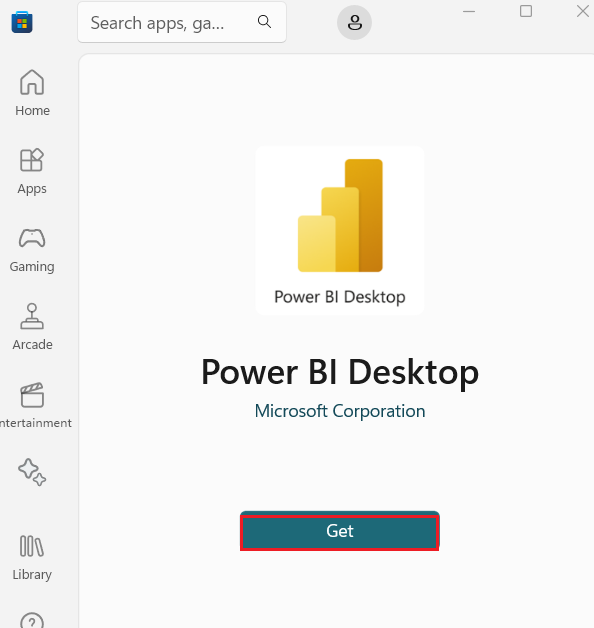

12. Now, click on the **Open** button.

     

13. Enter your **Microsoft Office 365** **tenant** credentials and click
    on the **Next** button.

     

14. Enter the **Administrative password** from the **Resources** tab and
    click on the **Sign in** button . 

     

15. In Power BI Desktop, select **New.**

     

16. , On the *Home* ribbon, click the ***OneLake data hub*** and select
    **KQL Database.**

      

17. On the **OneLake data hub** window, select the **StockDB**  and
    click on the **Connect** button.

      

18. Enter your **Microsoft Office 365** tenant credentials and click on
    the **Next** button.

      

19. Enter the **Administrative password** from the **Resources** tab and
    click on the **Sign in** button . 

    

20. In the Navigator page, under **Display Options**, select
    **StockPrice** table, then click on the **Load** button.

      

21. In the ***Connection settings*** dialog box, select ***DirectQuery**
    radio button and click on **OK** button.*

      

22. On the ***Home*** ribbon, click the ***OneLake data hub*** and
    select **Power BI semantic models** as shown in the below image.

      
23. On the **OneLake data hub** window, select
    the **StockLakehousePredictions** from the list and click on the
    **Connect** button.

      

24. In the **Connect to your data** page, select **dim_symbol,
    stock_prediction**, and click on the **Submit** button.

   

25. In this case, we can dismiss the **Potential security risk** warning
    by clicking on the **OK** button.

     
    
     

26. Click on  **Modeling** in the command bar, then click on  **Manage
    relationships.** 

     

27. In the **Manage relationships** pane, select **New** as shown in the
    below image.

     

28. Create a new **many-to-many** relationship between
    the ***StockPrice*** - **symbol**and
    the ***stocks_prediction*** - **Symbol**(after selecting the
    table, ensure to select the symbol columns in each table). Set the
    cross filter direction to  **Both** , and make sure the cardinality
    is set to **Many-to-many** Then, click on the **OK** button.

     

29. In Mange relationships page, click on the **Close** button.

    

30. In the **Power BI** page, under **Visualizations**, click on the
    **Line chart** icon to add a **Column chart** to your report.

      - On the **Data** pane, expand **StockPrice**  and check the box next
        to **timestamp**. This creates a column chart and adds the field to
        the **X-axis**.
      
      - On the **Data** pane, expand **StockPrice** and check the box next
        to **Price**. This adds the field to the **Y-axis**.
      
      - On the **Data** pane, expand **StockPrice** and check the box next
        to **Symbol**. This adds the field to the **Legend**.
      
      - **Filter**: **timestamp** to ***Relative time** is in the last **15
        minutes***.

      

      

31. In the **Power BI** page, under **Visualizations**, click on the
    **Line chart** icon to add a **Column chart** to your report.

      - On the **Data** pane, expand **StockPrice**  and check the box next
        to **timestamp**. This creates a column chart and adds the field to
        the **X-axis**.
      
      - On the **Data** pane, expand **StockPrice** and check the box next
        to **Price**. This adds the field to the **Y-axis**.
      
      - On the **Data** pane, expand **dim_symbol** and check the box next
        to **Market**. This adds the field to the **Legend**.
      
      - **Filter**: **timestamp** to ***Relative time** is in the last **1
        hour***.

      
      
      
      
      
      
      

32. In the **Power BI** page, under **Visualizations**, click on the
    **Line chart** icon to add a **Column chart** to your report.

      - On the **Data** pane, expand **Stock_prediction**  and check the box
        next to **predict_time**. This creates a column chart and adds the
        field to the **X-axis**.
      
      - On the **Data** pane, expand **Stock_prediction**  and check the box
        next to **yhat**. This adds the field to the **Y-axis**.
      
      - On the **Data** pane, expand **Stock_prediction** and check the box
        next to **Symbol**. This adds the field to the **Legend**.
      
      - **Filter**: **predict_time** to ***Relative date** in the last **3
        days***.

      
      
      
      

33. In the **Power BI** page, under **Data,** right click
    the ***stocks_prediction*** table and select ***New measure.***

    

34. Measures are formulas written in the Data Analysis Expressions (DAX)
    language; for this DAX formula, enter +++***currdate = NOW()+++* **

     

35. With the prediction chart selected, navigate to the additional
    visualization options i.e., the magnifying glass/chart icon and add
    a **new X-Axis Constant Line** .

    

36. Under  Value , use the formula button **(fx)** to choose a field.

    

37. In **Value -Apply settings to** page, click on the dropdown under
    **what field should we base this on?**, then click on the dropdown
    of **stocks_prediction**, select the ***currdate* **measure. Then,
    click on the **OK** button.

      
      
      

38. Navigate to the additional visualization options i.e., the
    magnifying glass/chart icon, turn On the **Shade area**.
   

40. Configured the relationships between tables, all visual should cross
    filter; when selecting either a symbol or market on a chart, all
    visuals should react accordingly. As shown in the below image, the
    **NASDAQ** market is selected on the upper-right market chart:

    
    
40. Click on the  **Publish** in the command bar. 

      

41. In **Microsoft Power BI Desktop** dialog box, click on the **Save**
    button.

    

42. In **Save this file** dialog box, enter the Name as **Prediction
    Report** and select the location. Then, click on the **Save**
    button.

    

## Task 3: Clean up resources

1.  Select your workspace, the  ***RealTimeFabricWorkspaceXXX***  from
    the left-hand navigation menu. It opens the workspace item view.

    

2.  Select the ***...*** option under the workspace name and
    select **Workspace settings**.

    

3.  Select **General** and **Remove this workspace.**

     

4.  Open your browser, navigate to the address bar, type or paste the
    following URL:
    [*https://portal.azure.com/*](https://portal.azure.com/), then press
    the **Enter** button.

5.  To delete the fabric account, navigate to **Azure portal Home**
    page, click on **Resource groups**.

    

6.  Click on the resource group that you’ve created.

    

7.  In the Resource group home page, select the **Delete resource
    group** button

      

8.  In the **Delete Resources** pane that appears on the right side,
    navigate to **Enter “resource group name” to confirm deletion**
    field, then click on the **Delete** button.

    
    
    

9.  Navigate to **Azure portal Home** page, click on **Resource
    groups**.

      

10. Click on the resource group that you’ve created.

      

11. In the Resource group home page, select the **Delete resource
    group** button

      

12. In the **Delete Resources** pane that appears on the right side,
    navigate to **Enter “resource group name” to confirm deletion**
    field, then click on the **Delete** button.

      
      
      
      
      

**Summary**

In this lab, you’ve signed up for the Microsoft Fabric trial and
redeemed Azure Pass, followed by configuring permissions and creating
necessary resources within the Azure portal such as Fabric Capacity,
Workspace, and Storage Account. Then, you’ve deployed the stock
generator app via Azure Container Instance using an ARM template to
generate real-time stock data. Additionally, you’ve configured
Eventstream in Microsoft Fabric to ingest data from Azure Event Hubs and
prepared the KQL Database to store this data efficiently. In this lab,
you’ve established a fully functional environment to proceed with
subsequent lab exercises related to real-time analytics and data
processing.

In this lab, you embarked on a comprehensive exploration of stock price
data using Kusto Query Language (KQL). Starting with the creation of a
KQL queryset named "StockQueryset," you executed a series of
increasingly complex queries to analyze various facets of the data. From
viewing sample records to calculating price differentials over time and
identifying significant price gains, each query unveils valuable
insights into the dynamics of stock prices. By leveraging windowing
functions, aggregation techniques, and data partitioning, you gained a
deeper understanding of stock price trends and fluctuations.

Then, you’ve shifted the focus to optimizing Power BI reporting
efficiency, where you configured refresh rates and crafted dynamic
visualizations for real-time dashboards. By configuring refresh rates in
the Power BI admin portal and creating Power BI reports based on the
previously defined KQL queries, you ensured timely updates and enabled
insightful visualization of stock price data. Through tasks like
creating visualizations for percent change and configuring auto-refresh
settings, you harnessed the full potential of Power BI to drive informed
decision-making and enhanced business intelligence capabilities.

In this lab, you’ve configured a comprehensive Lakehouse infrastructure
and implemented data processing pipelines to handle real-time and batch
data streams effectively. You’ve started with the creation of the
Lakehouse environment, the lab progresses to configuring Lambda
architecture for processing hot and cold data paths.

You’ve applied data aggregation and cleansing techniques to prepare the
raw data stored in the Lakehouse for downstream analytics. You’ve built
aggregation tables to summarize data at different levels of granularity,
facilitating efficient querying and analysis. Subsequently, you’ve built
a dimensional model within the Lakehouse, incorporating fact and
dimension tables. You’ve defined the relationships between these tables
to support complex queries and reporting requirements.

Finally, you’ve generated a semantic model to provide a unified view of
the data, enabling the creation of interactive reports using
visualization tools like Power BI. This holistic approach enables
efficient data management, analysis, and reporting within the Lakehouse
environment.

In this lab, you’ve learned how to approach a data science solution in
Fabric by importing and executing a notebook that processed data,
created a ML model of the data using Prophet, and stored the model in
MLflow. Additionally, you’ve evaluated the model using cross validation
and tested the model using additional data.

You’ve followed up on the creation of the ML model by consuming the ML
model, generating predictions, and storing those predictions in the
Lakehouse. Refined the process to build a model and generate predictions
in a single step, streamlining the process of creating predictions and
operationalizing the model generation. Then, you’ve created a report (or
reports) that show the current stock prices with predicted values,
making the data available for business users.
