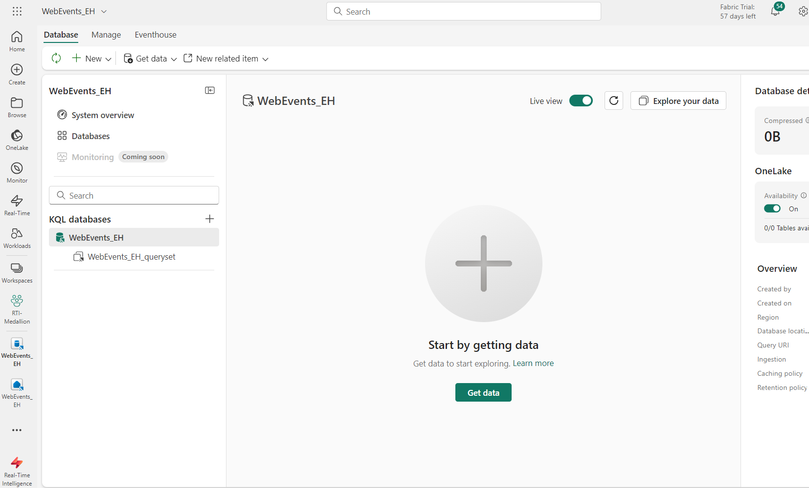
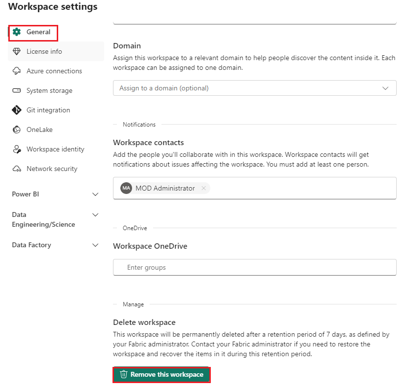

# **Use case 04: Building real-time Medallion Architecture in KQL using update policy**

**Introduction**

A medallion architecture (also coined by Databricks) is a data design
pattern used to logically organize data. The goal is to incrementally
improve the structure and quality of data as it flows through each layer
of the architecture. Medallion architectures are sometimes also referred
to as "multi-hop" architectures.

Creating a multi layer data platform allow companies to improve data
quality across the layers and at the same time provide for their
business needs. Unstructured and raw data are ingested using scalable
pipelines to output the highest quality enriched data. It contains 3
basic layers.

Bronze layer 

- Contains raw data, sometimes referenced as the data staging area.

- Not accessible to consumers only to engineers.

- May contain data with PII (personal identifiable information).

Silver layer 

- Contains deduplicated, enriched data.

- Accessible to all consumers.

- Contains “anonymized data” (no PII).

- Consumers: Data analysts, Data scientists, Engineers.

Gold layer 

- Contains aggregated data.

- Accessible to all consumers.

- Built for dashboards.


**Objective**

- Build a web traffic analytics solution using Fabric Real-Time
  Intelligence based on clickstream data.

- Use Fabric shortcuts to query data without move or copy (with
  AdventureWorksLT sample data).

- Stream events into Fabric Eventhouse via Eventstream.

- Create real-time data transformations in Fabric Eventhouse through the
  power of Kusto Query Language (KQL).

- Leverage OneLake availability to access data via Lakehouse.

- Create real-time visualizations using Real-Time Dashboards.

- Build Data Activator Reflex actions and alerts on the streaming
  data**.**

## **Task 1: Create a Fabric workspace**

In this task, you create a Fabric workspace. The workspace contains all
the items needed for this lakehouse tutorial, which includes lakehouse,
dataflows, Data Factory pipelines, the notebooks, Power BI datasets, and
reports.

1.  Open your browser, navigate to the address bar, and type or paste
    the following URL: +++https://app.fabric.microsoft.com/+++ then
    press the **Enter** button. In the **Microsoft Fabric Home** page,
    navigate and click on **Power BI** tile.

    
2.  In the **Power BI Home** page left-sided navigation menu, navigate
    and click on **Workspaces** as shown in the below image.

    

3.  In the Workspaces pane, click on **+** **New workspace button**

    

4.  In the **Create a workspace** pane that appears on the right side,
    enter the following details, and click on the **Apply** button.

      |   |   |
      |---|---|
      |Name|	+++RTI-Medallion+++|
      |Advanced|	Select Fabric Trial|
      |Default storage format|	Small dataset storage format|


     
      
       

## Task 2: Create a new Eventhouse

1.  On the bottom left experience switcher, select **Real-Time
    Intelligence**.

     

2.  On the **Real-Time Intelligence** home page, select **Eventhouse**.
    Name the Eventhouse **+++WebEvents_EH+++** and click on the
    **Create** button.

      
     
       

3.  When provisioning is complete, the eventhouse **System
    overview** page is shown.

     

## Task 3: Turn on OneLake availability

1.  From the **System overview** page, select the **WebEvents_EH** KQL
    database you created in the previous task.

     

2.  In the **Database details** section, click on the **OneLake
    availability** as shown in the below image to change the setting
    and, then click on the **Turn on** Toggle the button enable OneLake
    access.

    

     

## **Task 4: Create a new Eventstream**

In this section we will be streaming events (impressions and clicks
events) generated by a notebook. The events will be streamed into an
eventstream and consumed by our Eventhouse KQL Database.

1.  Now, click on **RTI-Medallian** on the left-sided navigation pane.

     

2.  From your workspace, click on  **+ New item** \> **Eventstream** as
    shown in the below image.  Enter **Eventstream** as
    +++WebEventsStream_ES+++

      
     
      

3.  On the Screen **Design a flow to ingest, transform, and route
    streaming events** click on **Use Custom Endpoint**. This will
    create an event hub connected to the Eventstream.

    

4.  Insert +++WebEventsCustomSource+++ as the source name and the click
    on **Add**.

     

5.  Click on the **Publish** button.

    

6.  Now the Eventstream will be published and the Event Hub will be
    created.

7.  On the **Eventstream** pane ,  select the **keys** under the
    **Details**, select **SAS key Authentication ,** copy the **Event
    hub name**, **connection strings-primarykey** and paste them on a
    notepad, as you need them in the upcoming task

    

Note: It does not matter if you copy the primary or secondary connection
string.

## Task 5: Import Data Generator Notebook

1.  Now, click on **RTI-Medallian** on the left-sided navigation pane.

       

2.  On the **Real-Time Intelligence** page, from the menu bar, navigate
    and click on **-\>|Import** button, then select **Notebook** and
    select **From this computer** as shown in the below image.

    

3.  Select **Upload** from the **Import status** pane that appears on
    the right side of the screen.

      

4.  Navigate and select **Generate synthetic events** notebooks from
    **C:\LabFiles**and click on the **Open** button.

      

5.  You will see a notification stating **Imported successfully.**

      

6.   Then , select the **Generate synthetic events** notebook.

      

      **Note**: DO NOT use an InPrivate browser window. Recommend using a
      Personal browser window for the Notebook session to connect & run
      successfully.

7.  To start the notebook, run the the 1^(st) cell.

      
 
    **Note:** It can happen that the notebook will throw some errors in
    cell 1. These errors are caused by libaries that already have been
    installed in the environment. You can safely ignore these errors. The
    notebook will execute successfully regardless of these errors.
   
    

8.  In the **2^(nd)** cell paste the **connection string of your custom
    app source and eventHunNameevents**(the value that you have saved in
    your notepad in the **Task 4\>Step 7)**, select the **Run** icon
    that appears on the left side of the cell.

    

9.  Select and run the 3^(rd) ,4^(th) cells

    

    

10. The last code cell and it should begin to print the generated
    synthetic events in JSON format. The last code cell its still
    running continue the next steps.

    

## Task 6: Define destination in the Eventstream

Next we have to create the Eventstream topology that will insert the
streamed data into our KQL Database. To aceive this please follow the
following steps.

1.  Now, click on **WebEventStream_ES** on the left-sided navigation
    pane.

     

2.  In the event stream authoring canvas, select the **Edit**

      

3.  Click on the node **Transform events or add Destination** and
    select **Filter** from the menu.

      

4.  Click on the pencil icon in the node **Filter** to enter edit mode.

    

5.  Provide the following values in the pane **Filter** on the left
    side. Then click on **Save**.

      |Field|	Value|
      |--|---|
      |Operation name|	+++ClickEventsFilter+++|
      |Select a field to filter on|	eventType|
      |Keep events when the value|	equals|
      |value|	CLICK|

      

      **Note:** CLICK is in ALL CAPS.

      **Note**: It is normal that the node ClickEventsFilter is shown with an
      error. The error indicates that there is no target for the datastream
      coming out of the filter. We will fix this in the next step.

6.  Click on **+** icon next to the **ClickEventsFilter** node. and
    choose **Stream** from the context menu.

      

7.  Coose **Stream** from the context menu.

      

8.  Click on the pencil in node **Stream1** to go to edit mode.
    Enter +++ClickEventsStream+++ as name of the Eventstream in the
    field **Stream name**. Ensure that the **Input data
    format** is **Json**. Click on the Button **Save**.

     
 
      

9.  Click on **+** icon next to the node **ClickEventsStream**.

      

10. Select the option **Eventhouse** in the context menu.

      

11. Click the pencil in node **Eventhouse** to enter edit mode. Provide
    the following values in the pane **Eventhouse**. Click the
    button **Save** after you entered all the values.

      |Field|	Value|
      |---|---|
      |Event processing before ingestion	|Ensure that this option is selected.|
      |Destionation name|	ClickEventStore|
      |Workspace|	Select RTI-Medallion |
      |Eventhouse	|Select the Eventhouse WebEvents_EH|
      |KQL Database|	Select the KQL Database WebEvents_EH|
      |Destination table|	Click on Create new and enter +++BronzeClicks+++ as name for the new table and click on **Done**|.
      |Input data format|	Ensure that the option **Json** is selected.|


      
      
      

12. Click on **Insert a node** sign next to the
    node **WebEventsStream_ES**.

    

13. Choose the option **Filter** from the context menu.

      

14. Delete the connection between the new filter node **Filter1** and
    the node **ClickEventsFilter** by clicking on the trashcan icon.

      

15. Connect the output of the node **WebEventsStream_ES** to the input
    of the node **ClickEventsFilter**.

      

16. Click on the pencil icon of the new node **Filter1** to enter edit
    mode. Provide the following values in the pane **Filter** on the
    left side. Then click on **Save**.

      |Field|	Value|
      |---|----|
      |**Operation name**|	+++ImpressionEventsFilter+++|
      |**Select a field to filter on**|	eventType|
      |**Keep events when the value**|	equals|
      |**value**|	IMPRESSION|


    
   
     **Note:** IMPRESSION is in ALL CAPS.
     
      **Note:** It is normal that the node ImpressionEventsFilter is shown
      with an error. The error indicates that there is no target for the
      datastream coming out of the filter. We will fix this in the next
       step.

17. Click on **+** sign next to the **ImpressionEventsFilter** node and
    choose **Stream** from the context menu.

      
      
      

18. Click on the pencil icon in the node **Stream1** to enter edit mode.
    Enter **+++ImpressionsEventsStream+++** as name of the Eventstream
    in the field **Stream name**. Ensure that the **Input data
    format** is **Json**. Click on the Button **Save**.

      

19. Click on **+** icon next to the node **ImpressionEventsStream** and
    select **Eventhouse** from the context menu.

      

20. Click the pencil in node **Eventhouse1** to enter edit mode. Provide
    the following values in the pane **Eventhouse**.

      |Field|	Value|
      |---|---|
      |Event processing before ingestion|	Ensure that this option is selected.|
      |Destionation name	|ImpressionEventStore|
      |Workspace|	Select **RTI-Medallion**. If you attend the Precon at dataMinds Connectrope please select the Workspace Name that was provided to you.|
      |Eventhouse	|Select the Eventhouse **WebEvents_EH**|
      |KQL Database|	Select the KQL Database **WebEvents_EH**|
      |Destination table|	Click on Create new and enter +++BronzeImpressions+++ as name for the new table and click on **Done**.|
      |Input data format|	Ensure that the option **Json** is selected.|


21. After providing these values click on the button **Save**.

    
    
    

21. Click on the button **Publish** that is located in the toolbar at
    the top of the screen.

      
     
      

22. After a few minutes, you should see the nodes 
    **ClickEventStore** and **ImpressionEventStore** change to
    mode **Streaming**.

    

23. In the end your Eventstream toplogy should look like the image
    below.

     

## Task 7: Setting up the Lakehouse 

In this task we will set up the Lakehouse that will contain additional
information for our usecase and in which we will also make the data from
the KQL Database accessible through the lakehouse.

1.  To create a Lakehouse we first have to return to the workspace where
    all other objects are in. To do so click on the
    icon **RTI-Medallian** in the left toolbar. If you are attending the
    dataMinds Connect Europe Precon this is the workspace that was
    provided to you.

    

2.  Click on the button **+ New Item** in the toolbar and in the popin
    window click on the tile **Lakehouse**.

      

3.  In the dialog **New lakehouse** enter +++WebSalesData_LH+++ as name
    for the new lakehouse. Ensure that the checkbox **Lakehouse schemas
    (Public Preview)** is not checked. Then click on the
    button **Create**

    

## Task 8: Uploading reference data files and creating delta tables in the lakehouse 

After our lakehouse has been created the overview page of the lakehouse
will be displayed. Next task we have to accomplish is to load static
data into our new lakehouse. To do so please execute the following
steps.

1.  Click on the button **Get data** in the toolbar and select **Upload
    Files** from the dropdown menu.

    

2.  To upload the two files click on the folder symbol under
    **C:Labfiles/**. Select the two
    files **products.csv** and **productcategory.csv**. Then click on
    the button **Open**.

      
     
     

      **To select the two files at once you can just hold the key CTRL while
      you click the two files.**

3.  In the popin window **Upload files** click on the button **Upload**.
    Now the files will be uploaded.

     

4.  To check that the files have been uploaded successfully, click on
    the folder **Files** in the pane **Explorer**. You should see the
    files in the list **Files** in the right part of the window.

      

5.  Next we have to create delta tables in our Lakehouse from the files
    we uploaded. To do this access the context menu by clicking on the
    three dots (**...**). Select **Load to tables** from the context
    menu.

     

6.  In the submenu click on **New table**

     

7.  Retain all default values and click on the button **Load**.

     

8.  This steps have to be executed for the file productcategory.csv as
    well as for the file **product.csv.**

      
     
      
     
      

9.  Ensure that both
    files **products.csv** and **productcategory.csv** are available as
    delta tables in your lakehouse. Your lakehouse should look like
    this:

     

## Task 9: Accessing Eventhouse data from the lakehouse  

In this task we will make the Eventhouse tables form the KQL Database
available in our Lakehouse. This will be accomplished by
creating *shortcuts*.

1.  Click on the button **Get data** in the menu bar at the top.
    Choose **New shortcut** from the dropdown menu.

      

    If your Lakehouse is using Schemas you will see the
    schema **dbo** under the folder **Tables**. right-click the
    schema **dbo** and select the option New table shortcut from the
    context menu.

2.  Select **Microsoft OneLake.**

    

3.  Select the KQL Database **WebEvents_EH** in the Window **Select a
    data source type** and click on the button **Next**.

      

4.  Expand the folder **Tables** under **WebEvents_EH** in the
    window **New shortcut** and check both
    tables **BronzeClicks** and **BronzeImpressions**. Click
    on **Next**.

    

    **Note:** You may return to this step to create additional shortcuts,
    after running the createAll.kql database script which will create
    additional tables. For now, you may proceed by selecting just
    the BronzeClicks and BronzeImpressions tables.

5.  Click on the button **Create**.

      

6.  Now you can see the shortcuts to the tables **BronzeClicks** and
    **BronzeImpressions** under the folder Tables in the lakehouse
    **WebSalesData_LH**.

     

    **Note:** Note that the shortcuts have another icon than the regular
    delta tables.

## Task 10: Build the KQL DB schema  

In this section we will create all the silver tables, functions and
enable update policies and in our Eventhouse KQL Database. Two of the
tables (product and productCategory) are shortcuts to the lakehouse and
the data is **NOT** being copied into our KQL Database.

     

1.  Open the KQL Database **WebEvents_EH** in the Eventhouse of your
    Fabric Workspace. To do so click on the Icon of the Eventhouse in
    the left toolbar.

     

2.  Click on the button **+ New** in the top toolbar and
    choose **OneLake shortcut** from the drop down menu.

      

3.  Select **Microsoft OneLake**..

     

4.  Select the lakehouse **WebSalesData_LH** and click on the
    button **Next**.

      

5.  Expand the folder **Tables**, select the table **products** table
    and click on the button **Create**. This will create a shortcut to
    the table **products** in your Lakehouse without copying the data
    from the Lakehouse to Eventhouse.

      
  
      
   
      

6.  Repeat the steps above for the table **productcategory** to create a
    shortcut for this table as well.

      
     
      
     
      
     
      
     
      

7.  Expand the folder **Shortcuts** in the tree of your
    Eventhouse **WebEvents_EH** to verify if the 2 shortcuts have been
    created correctly.

      

8.  Click on the button **Explore your Data** at the top of the screen.

      

     The window **Explore your data** will be shown.

     

9.  On the left side in the pane **KQL Databases** underneath the
    node **WebEvents_EH** there is the automatically created
    queryset **WebEvents_EH_queryset**. Click on this queryset and
    replace the text in the tab **WebEvents_EH** by the contents of the
    file createAll.kql. Then click on the Button **Run**
        ```
        .execute database script <|
        //SILVER LAYER
        .create table SilverClicks (
            eventType:string, 
            eventID:string, 
            eventDate:datetime, 
            productId:long, 
            userAgent:dynamic, 
            device:string, 
            ip_address:string, 
            referer:dynamic, 
            page_loading_seconds:real, 
            clickType:string, 
            clickPathTitle:string, 
            clickPathUrl:string
        )
        //
        .create table SilverImpressions (
            eventType:string, 
            eventID:string, 
            eventDate:datetime, 
            productId:long, 
            userAgent:dynamic, 
            device:string, 
            ip_address:string, 
            page_loading_seconds:real, 
            relatedProductCategory:string, 
            relatedProductId:string, 
            relatedProductName:string
        )
        // use update policies to transform data during Ingestion
        .create-or-alter function with (folder="Bronze to Silver Transformations") expandClickpath()
        {
        BronzeClicks
        | mv-expand extraPayload
        | evaluate bag_unpack(extraPayload)
        | project 
            eventType, 
            eventID, 
            todatetime(eventDate), 
            productId, 
            userAgent, 
            device, 
            ip_address, 
            referer, 
            toreal(page_loading_seconds), 
            clickType = clickType, 
            clickPathTitle = ['title'], 
            clickPathUrl = url
        }
        //
        .alter table SilverClicks policy update @'[{"Source": "BronzeClicks", "Query": "expandClickpath", "IsEnabled" : true, "IsTransactional": false }]'
        //
        .create-or-alter function with (folder="Bronze to Silver Transformations") expandRelatedProducts()
        {
        BronzeImpressions
        | mv-expand extraPayload
        | evaluate bag_unpack(extraPayload)
        | project 
            eventType, 
            eventID, 
            todatetime(eventDate), 
            productId, 
            userAgent, 
            device, 
            ip_address, 
            toreal(page_loading_seconds), 
            relatedProductCategory, 
            relatedProductId, 
            relatedProductName
        }
        //
        .alter table SilverImpressions policy update @'[{"Source": "BronzeImpressions", "Query": "expandRelatedProducts", "IsEnabled" : true, "IsTransactional": false }]'
        //
        .create-or-alter function with (docstring = "Social Media Campaign Clickstream", folder = "Gold Views") SocialMediaCampaignClickstream()
        {
        SilverClicks
        | extend CampaignType = tostring(referer.campaignType)
        | extend Platform = tostring(userAgent.platform)
        | extend Browser = tostring(userAgent.browser)
        | extend RefererUrl = tostring(referer.url)
        | extend AdTitle = tostring(referer.adTitle)
        | where CampaignType in ("facebook", "twitter", "instagram", "pinterest")
        | project-away userAgent, referer
        | project-reorder CampaignType
        }
        //
        .create-or-alter function with (docstring = "Search Media Campaign Clickstream", folder = "Gold Views") SearchMediaCampaignClickstream()
        {
        SilverClicks
        | extend CampaignType = tostring(referer.campaignType)
        | extend Platform = tostring(userAgent.platform)
        | extend Browser = tostring(userAgent.browser)
        | extend RefererUrl = tostring(referer.url)
        | extend AdTitle = tostring(referer.adTitle)
        | where CampaignType in ("google", "bing")
        | project-away userAgent, referer
        | project-reorder CampaignType
        }
        //
        .create-or-alter function with (docstring = "Email Campaign Clickstream", folder = "Gold Views") EmailCampaignClickstream()
        {
        SilverClicks
        | extend CampaignType = tostring(referer.campaignType)
        | extend Platform = tostring(userAgent.platform)
        | extend Browser = tostring(userAgent.browser)
        | extend RefererUrl = tostring(referer.url)
        | extend EmailId = tostring(referer.emailId)
        | where CampaignType in ("email")
        | project-away userAgent, referer
        | project-reorder CampaignType
        }
        ```
        
       

10. The status of the execution of the commands from the file  can be
    seen at the bottom of the pane. The result of each Command should
    be **Completed**.

    

11. Click on the pencil at the tab **WebEvents_EH** and rename the tab
    to **createAll**.

      
 
      

    **Note:** You can add additional tabs in the KQL Queryset to add new
    queries.

12. Expand all folders in the database pane on the left. All tables and
    functions that have been created by the script can be found here.

      

  **Note:** While on the KQL Database details screen you may explore
  additional Real-Time Intelligence Samples by clicking the drop-drop next
  to Get data and selecting a desired sample. These samples give you the
  ability to learn more.

## Task 11: Real-Time Dashboard  

In this task, we will build a real-time dashboard to visualize the
streaming data and set it to refresh every 30 seconds. (Optionally) A
pre-built version of the dashboard is available to download here, which
can be imported and configured to your KQL Database data source.
     

1.  Now, click on **RTI-Medallian** on the left-sided navigation pane.

     

2.  To create a new realtime dashboard click on the button **+ New
    Item** and the select **Real-Time Dashboard**

      

3.  Enter the name +++Web Events Dashboard+++ in the field **New
    Real-Time Dashboard**. Then click on **Create**.

      

4.  An empty dashboard will be displayed. To add a visualisation click
    on the button **+ Add tile**.

      

5.  Click on the Button **+ Data source** and select **One Lake Data
    Hub** .

      

6.  In the Window **One Lake Data Hub** select the
    Eventhouse **WebEvents_EH**. Then click on **Connect**.

      

7.  As name keep the given name WebEvents_EH. Set
    the **Database** to **WebEvents_EH** and click on the
    button **Add**.

      

8.  Set Time rage parameter at the top left to **Last 7 days**. This
    parameter is referenced by the query in the where clause by using
    fields \_startTime and \_endTime.

9.  Copy the following query and click **Run**.
      ```
      //Clicks by hour
      SilverClicks
      | where eventDate between (_startTime.._endTime)
      | summarize date_count = count() by bin(eventDate, 1h)
      | render timechart
      | top 30 by date_count
      ```

    Note: All queries are available in this script
    file [dashboard-RTA.kql](https://github.com/microsoft/FabricRTIWorkshop/blob/main/dashboards/RTA%20dashboard/dashboard-RTA.kql)
    is available in Labfiles folder

      

10.  Click on the **+Add visual**

     

11.  In the **Visual formatting** tab, set Tile name to +++Click by
    hour+++, set Visual type to **Area chart.** Click on the **Apply
    changes**.
    

12.  While editing the dashboard, click on the tab **Manage** on the top
    left then click on the
    button **Parameters**.
    

13.  To edit the parameter **Time range** click on the pencil icon. This
    will enter the edit mode for this parameter.

      

14.  Select **Last 7 Days** in the combo box **Default value**. Then
    click on **Done**.

      

15.  In the parameter pane click on the button **Close**.

      

16. Click on the tab **Home** and then click on the button **New
    tile** again to proceed with the next visuals.

      

17. In the query editor, **paste** the following code, then click on
    **Run** to execute the query.

    Impressions by hour 
    •	Visual type: Area chart.
    ```
      //Impressions by hour
      SilverImpressions
      | where eventDate between (_startTime.._endTime)
      | summarize date_count = count() by bin(eventDate, 1h)
      | render timechart
      | top 30 by date_count
    ```
    
     

18. Select **+Add visual**

      

19. In the **Visual formatting** tab, set Tile name to +++Impressions
    by hour+++, set Visual type to **Area chart.** Click on the **Apply
    changes**.

    

    

20.  While editing the dashboard, click **Home** on the top left, and
    select **New title** to proceed with the next visuals.
     

21. In the query editor, **paste** the following code, then click on
    **Run** to execute the query.

      Impressions by location #
      
      •	Visual type: Map.
      ```
      //Impressions by location
      SilverImpressions
      | where eventDate  between (_startTime.._endTime)
      | join external_table('products') on $left.productId == $right.ProductID
      | project lon = toreal(geo_info_from_ip_address(ip_address).longitude), lat = toreal(geo_info_from_ip_address(ip_address).latitude), Name
      | render scatterchart with (kind = map) //, xcolumn=lon, ycolumns=lat)
      ```
      
      

22. Select **+Add visual**

23. In the **Visual formatting** tab, set Tile name to +++Impressions by
    location+++, set Visual type to **Map.** Click on the **Apply
    changes**.

      
      
      

24. While editing the dashboard, click **Home** on the top left, and
    select **New title** to proceed with the next visuals.

      

25. In the query editor, paste the following code, then click on Run to
    execute the query.

      Average Page Load time #
      •	Visual type: Timechart.
      ```
      //Average Page Load time
      SilverImpressions
      | where eventDate   between (_startTime.._endTime)
      //| summarize average_loadtime = avg(page_loading_seconds) by bin(eventDate, 1h)
      | make-series average_loadtime = avg(page_loading_seconds) on eventDate from _startTime to _endTime+4h step 1h
      | extend forecast = series_decompose_forecast(average_loadtime, 4)
      | render timechart
      ```

    

26. Select **+Add visual**

27. In the **Visual formatting** tab, set Tile name to +++Average Page Load time+++, set Visual type to **Time chart.** Click on the **Apply changes**.

      
      
28. While editing the dashboard, click **Home** on the top left, and
    select **New title** to proceed with the next visuals.

      

29. In the query editor, **paste** the following code, then click on
    **Run** to execute the query.

      Impressions, Clicks & CTR 
      ```
      //Clicks, Impressions, CTR
      let imp =  SilverImpressions
      | where eventDate  between (_startTime.._endTime)
      | extend dateOnly = substring(todatetime(eventDate).tostring(), 0, 10)
      | summarize imp_count = count() by dateOnly;
      let clck = SilverClicks
      | where eventDate  between (_startTime.._endTime)
      | extend dateOnly = substring(todatetime(eventDate).tostring(), 0, 10)
      | summarize clck_count = count() by dateOnly;
      imp
      | join clck on $left.dateOnly == $right.dateOnly
      | project selected_date = dateOnly , impressions = imp_count , clicks = clck_count, CTR = clck_count * 100 / imp_count
      ```
     

30. Enter +++Impressions+++ in the field **Tile name**.
    Select **Stat** in the combobox **Visual type**. In combobox **Data
    Value column** select **impressions (long)**. Then click on the
    button **Apply changes**.

    
    
    

31. Click the 3-dots (**...**) at the top right of the tile you just
    created and select **Duplicate** from the context menu to duplicate
    it two more times.

      

32. Name the 2nd one Clicks, set the Data value column to **clicks
    (long)**, then click on the button **Apply changes**.

     
     
      

33. Name the 3rd Click Through Rate, set the Data value column
    to **CTR**, then click on the button **Apply changes**.

    

     

34. While editing the dashboard, click **Home** on the top left, and
    select **New title** to proceed with the next visuals.

     

35. In the query editor, **paste** the following code, then click on
    **Run** to execute the query

    Average Page Load Time Anomalies #
    Visual type: Timechart
    ```
    //Avg Page Load Time Anomalies
    SilverImpressions
    | where eventDate   between (_startTime.._endTime)
    | make-series average_loadtime = avg(page_loading_seconds) on eventDate from _startTime to _endTime+4h step 1h
    | extend anomalies = series_decompose_anomalies(average_loadtime)
    | render anomalychart
    
    ```
    

36. Clicking **+ Add visual**.

      

37. In the **Visual formatting** tab, set Tile name to +++Avg Page Load Time Anomalies+++, Click on the **Apply changes**.

     
     
      

38. While editing the dashboard, click **Home** on the top left, and
    select **New title** to proceed with the next visuals.

     

39. In the query editor, **paste** the following code, then click on
    **Run** to execute the query

    Strong Anomalies #
    ```
    //Strong Anomalies
    SilverImpressions
    | where eventDate between (_startTime.._endTime)
    | make-series average_loadtime = avg(page_loading_seconds) on eventDate from _startTime to _endTime+4h step 1h
    | extend anomalies = series_decompose_anomalies(average_loadtime,2.5)
    | mv-expand eventDate, average_loadtime, anomalies
    | where anomalies <> 0
    | project-away anomalies
    ```
    
    

31. In the **Visual formatting** tab, set Tile name to +++Strong Anomalies+++, set Visual type to **Map.** Click on the **Apply changes**.

      
     
     

## Task 12: Logo (Markdown Text Tile)  

1.  Click on the button **New text tile** in the toolbar at the top.

    

2.  Paste the following code in the text area and click on the
    button **Apply changes**
    ```
    //Logo (Markdown Text Tile)
    
    ```
    
    

     
    
    **Note: The title can be resized on the dashboard canvas directly,
    rather than writing code.**

    After you added all the visuals and moved them to thier appropiate
    places your dashboard should look similar to this.

     

## Task 13: Auto-refresh  

In this task we will enable auto-refresh so the dashboard will be
automatically updated while it is shown on screen.

1.  While editing the dashboard, click on the tab **Manage** and then
    click on the button **Auto refresh**. This will open a pane on the
    right side of the browser.

      

2.  In the pane **Auto refresh** set it to **Enabled** and set **Default
    refresh rate** to **Continous**. Then click on the button **Apply**

      

3.  Click on the tab **Home** and then click on the button **Save**.

     

## **Task 14:** create a Reflex Alert

In this task we will create a Reflex Alert that will send a Teams
Message when a value meets a certain threshold.

1.  While editing the dashboard, click on the three dots (**...**) of
    the tile **Click by hour**. Select **Set alert** from the context
    menu. This will open the pane **Set alert** at the right side in the
    browser.

      

2.  In the pane **Set alert** set the values as stated in the following
    table

      |Field|	Value|
      |---|---|
      |Check|	**On each event grouped by**|
      |Grouping field|	**event_date**|
      |When|	**date_count**|
      |Condition	|**Becomes greater than**|
      |Value|	**250**|
      
     

3.  Select **Message me in teams** as **Action**.

      

4.  In the combobox **Workspace** select the workspace. In our example
    the workspace is named **RTI-Medallion**. If you do the Lab at
    dataMinds Connect Europe choose the workspace name that was provided
    to you. Ensure that in the combobox **Item** the value **Create a
    new item** is selected. Insert My Reflex as value for the
    field **New item name**. Then click on the button **Create**.

      

The Reflex item will appear in your workspace and you can edit the
Reflex trigger action. The same Reflex item can also trigger multiple
actions.

## Task 13: Stop the notebook** **

> At this point you've completed the lab, so you may stop running the
> notebook.

1.  Open the notebook "Generate synthetic events" from your workspace
    and click **Stop** on the last code cell if its still running.

      

2.  You can click **Cancel All** on the top menu or click the stop
    red-square button to Stop session. These only appear when your
    session is active or the notebook is running.

    
    
    

## Task 14: Clean up resources

1.  Select your workspace, the **RTI-Medallian** from the left-hand
    navigation menu. It opens the workspace item view.
     

2.  Select the *...* option under the workspace name and
    select **Workspace settings**.

    

3.  Select **General** and **Remove this workspace.**

     

**Summary**

In this use case you learn to set up your Fabric workspace and related
components, start by creating a workspace that includes essential items
like a lakehouse, dataflows, pipelines, notebooks, datasets, and
reports. Next, set up an Eventhouse to handle streaming events and
enable OneLake availability for seamless data access. Create an
Eventstream to ingest and route streaming events, and import a data
generator notebook to simulate event data. Define destinations in the
Eventstream to insert streamed data into the KQL Database. Set up a
Lakehouse for additional data storage and access, then upload reference
data files and create delta tables to load static data. Use shortcuts to
access Eventhouse data from the Lakehouse. Build the KQL Database schema
by creating tables, functions, and enabling update policies. Create a
real-time dashboard to visualize data, set it to refresh every 30
seconds, and customize it by adding a logo. Enable auto-refresh to keep
the dashboard updated automatically. Finally, create a Reflex Alert to
send notifications based on data thresholds, and finish by stopping the
notebook and cleaning up resources.
